<div align="center">

# UKIP

**Universal Knowledge Intelligence Platform**

[](https://www.python.org/)
[](https://fastapi.tiangolo.com/)
[](https://react.dev/)
[](https://nextjs.org/)
[](https://tailwindcss.com/)
[](https://duckdb.org/)
[](https://www.trychroma.com/)
[](backend/tests/)
[](LICENSE)

A domain-agnostic intelligence platform that ingests raw data, harmonizes it, enriches it against global knowledge bases, runs OLAP analytics and stochastic simulations, builds entity relationship graphs, and lets you query everything through an agentic RAG-powered AI assistant — with custom dashboards, scheduled reports, Slack/Teams alerts, and a public API ecosystem.

[Features](#features) · [Quick Start](#quick-start) · [Architecture](#architecture) · [API](#api-overview) · [Roadmap](#roadmap) · [Strategic Vision](docs/EVOLUTION_STRATEGY.md)

</div>

---

## Why UKIP?

Most data platforms force you to choose: clean your data **or** analyze it. UKIP does both in a single pipeline. It started as a catalog deduplication tool and evolved into a full research intelligence engine across **82 development sprints**.

**What it does:**

1. **Ingest** any structured data (Excel, CSV, JSON-LD, XML, BibTeX, RIS, Parquet) through a 5-step wizard with AI-assisted column mapping or direct API.
2. **Harmonize** messy records with fuzzy matching, authority resolution against 5 global knowledge bases (Wikidata, VIAF, ORCID, DBpedia, OpenAlex), and bulk normalization rules.
3. **Enrich** every record against academic APIs (OpenAlex, Google Scholar, Web of Science, Scopus).
4. **Graph** relationships between entities — citations, authorship, membership, and semantic links — with BFS subgraph traversal and SVG visualization.
5. **Analyze** with OLAP cubes (DuckDB), Monte Carlo simulations, topic modeling, correlation analysis, and I+D ROI projections.
6. **Query** your entire dataset in natural language — either through the agentic RAG assistant or the **NLQ engine** that translates plain English directly to OLAP queries.
7. **Build dashboards** — each user gets a personal workspace with drag-and-drop widget panels, 8 widget types, and persistent layouts.
8. **Automate** with scheduled reports (PDF/Excel/HTML delivered by email on any cadence), Slack/Teams/Discord push alerts for 8 platform events, and cron-style data imports from connected stores.
9. **Integrate** programmatically through long-lived **API Keys** with scope control (`read`/`write`/`admin`) — zero friction for developer ecosystems.
10. **Collaborate** through threaded comments, full RBAC (4 roles), role-aware UI, and outbound webhooks.
11. **Observe** every action through a real-time audit log, notification center, and HTTP-level audit middleware.

### Design Philosophy

One rule: **Justified Complexity** ([details](docs/ARCHITECTURE.md)).

- Monorepo (FastAPI + Next.js). No microservices until proven necessary.
- If a dictionary solves it, we use a dictionary.
- Accessible for beginners, robust for production data tasks.

---

## Features

### Data Operations
- **Entity Catalog** — Browse, search, inline-edit, and delete records across any domain. Universal schema (`primary_label`, `secondary_label`, `canonical_id`, `entity_type`, `domain`). Dynamic pagination, FTS5 full-text search.
- **Entity Detail Page** — Dedicated route (`/entities/:id`) with six tabs: Overview (inline editing + quality score), Enrichment (Monte Carlo chart + concepts), Authority (candidate review), Comments (threaded annotations), Graph (relationship network + metrics strip), and Quality.
- **Entity Relationship Graph** — Typed, weighted directed edges (`cites`, `authored-by`, `belongs-to`, `related-to`). BFS subgraph traversal up to depth 2. SVG radial visualization with color-coded edge types, directional arrows, and hover tooltips.
- **Entity Quality Score** — 0.0–1.0 composite index: field completeness (40%), enrichment coverage (30%), confirmed authority (20%), relationship count (10%). Tri-color badge, `min_quality` filter, quality sort, and bulk recompute.
- **Graph Analytics Dashboard** — Whole-graph KPIs, top-10 PageRank leaderboard, degree centrality table, and BFS Path Finder.
- **Entity Linker** — Fuzzy pairwise duplicate detection, side-by-side comparison, merge (winner absorbs loser), and dismiss with persistence.
- **Bulk Import Wizard** — 5-step guided import with drag-and-drop, auto-preview, column auto-mapping, and **AI Suggest** LLM-assisted field mapping.
- **Multi-format Import/Export** — Excel, CSV, JSON, XML, BibTeX, RIS, Parquet, RDF/TTL.
- **Knowledge Graph Export** — GraphML (Gephi/yEd), Cytoscape JSON, JSON-LD with optional domain filter.
- **Domain Registry** — Custom schemas via YAML (Science, Healthcare, Business, or your own).
- **Demo Mode** — One-click seed of 1,000 demo entities with guided tour autostart.

### Data Quality
- **Fuzzy Disambiguation** — `token_sort_ratio` + Levenshtein grouping of typos, casings, and synonyms.
- **Authority Resolution Layer** — Weighted ARL scoring engine resolves against Wikidata, VIAF, ORCID, DBpedia, and OpenAlex. Batch resolution queue, bulk confirm/reject, evidence tracking.
- **Harmonization Pipeline** — Universal normalization steps with full undo/redo history.

### Analytics & Intelligence
- **Natural Language Query (NLQ)** — Ask your data in plain English. The active LLM translates the question to an OLAP query (`group_by` + `filters`), validates dimension names, and returns live results — with a "Edit in OLAP Explorer →" shortcut and 6 example question chips.
- **OLAP Cube Explorer** — DuckDB-powered multi-dimensional queries with drill-down navigation, 50-row pagination, and Excel pivot export.
- **Monte Carlo Citation Projections** — Geometric Brownian Motion model simulates 5,000 citation trajectories per record.
- **ROI Calculator** — Monte Carlo I+D projection engine. Returns P5–P95 percentiles, break-even probability, year-by-year ROI, and distribution histogram.
- **Topic Modeling** — Concept frequency, co-occurrence (PMI), topic clusters, and Cramér's V field correlations.
- **Executive Dashboard** — KPI summary cards, 7-day activity area chart, secondary label × domain heatmap, top concepts cloud, top entities table — with auto-refresh (5 min countdown) and "Export Dashboard → PDF" button.
- **Knowledge Gap Detector** — Automated 4-check scan (enrichment holes, authority backlog, concept density, dimension completeness), severity-rated with recommended actions.

### Custom Dashboards
- **Personal Dashboards** — Each user can create multiple named dashboards. One is marked as **default** and loads on entry.
- **8 Widget Types** — EntityKPI, EnrichmentCoverage (donut), TopEntities table, TopBrands bar chart, ConceptCloud, RecentActivity feed, QualityHistogram, OlapSnapshot.
- **Drag-to-Reorder** — HTML5 drag-and-drop on a 12-column CSS grid. Widgets can be 4, 6, 8, or 12 columns wide.
- **Widget Picker Modal** — Catalogue of all widget types with icons, labels, and descriptions. Click to add.
- **Edit / Save / Cancel** toolbar with unsaved-changes guard on dashboard switching.
- **User isolation** — Each user sees only their own dashboards; cross-user access returns 404.

### Automation & Delivery
- **Scheduled Reports** — Create recurring report schedules (hourly to weekly). Automatically generate PDF, Excel, or HTML reports and deliver them as email attachments to one or more recipients. Background scheduler thread (60s poll loop). Manual "Send Now" trigger. Pause/Resume toggle. Full error tracking with inline error detail.
- **Scheduled Imports** — Background thread imports from connected stores on configurable intervals (5 min to 7 days).
- **Alert Channels** — Push platform events to Slack, Microsoft Teams, Discord, or any generic webhook. Platform-native payloads (Block Kit for Slack, MessageCard for Teams, embeds for Discord). 8 subscribable event types. Webhook URLs encrypted at rest (Fernet). "Test" button fires a real delivery.
- **Event Catalogue** — `entities.imported`, `enrichment.completed`, `harmonization.applied`, `quality.low`, `report.sent`, `report.failed`, `import.scheduled`, `disambiguation.resolved`.

### Public API Keys
- **Key Generation** — `ukip_<40 random chars>`. Shown exactly once at creation time.
- **Secure Storage** — Only `key_prefix` (first 16 chars) + SHA-256 hash stored. Full key never persists in the database.
- **Transparent Auth** — `Authorization: Bearer ukip_...` works everywhere a JWT works. The `get_current_user()` dependency auto-detects key vs JWT.
- **Scopes** — `read` / `write` / `admin`. Expiry dates. Last-used timestamp tracking.
- **User Isolation** — Each user sees only their own keys. Cross-user revoke returns 404.
- **Developer UX** — Green "copy now" banner on creation, `curl` example in the UI.

### Artifact Studio
- **Report Builder** — Self-contained HTML/PDF/Excel/PowerPoint reports generated server-side.
- **Report Templates** — 4 built-in presets + custom template CRUD.
- **PowerPoint Export** — Branded 16:9 PPTX via `python-pptx`.
- **Artifact Studio Hub** (`/artifacts`) — Unified gateway with live gap counts and template library.

### Context Engineering & Agentic AI
- **Analysis Contexts** — Snapshot and restore domain state for LLM sessions.
- **Tool Registry** — Register, version, and invoke tool schemas from the UI.
- **Context-Aware RAG** — RAG queries enriched with active domain context and tool invocation history.
- **Agentic Tool Loop** — RAG assistant autonomously calls tools mid-reasoning (OpenAI tool-use, Anthropic tool_use, local fallback). Returns `tools_used`, `iterations`, and agentic flag. Togglable per-query.

### Collaborative Features
- **Threaded Annotations** — Comment on any entity or authority record. One-level reply threading. Edit/delete your own comments (admins can delete any). Full RBAC.
- **Comments Tab** — Integrated into the entity detail page with live count badge.

### Full-Text Search
- **SQLite FTS5 index** covering entities, authority records, and annotations.
- **Global search bar** in the header with debounced live dropdown (6 results) and keyboard navigation.
- **Search page** (`/search`) with type filter pills, ranked result cards, and pagination.

### Observability & Automation
- **Audit Log** — HTTP-level middleware captures every mutating request. Frontend timeline at `/audit-log` with stats bar, 7-day sparkline, filter bar, and CSV export.
- **Activity Feed** — Real-time audit timeline on the home dashboard. Auto-refreshes every 30 seconds.
- **Webhooks** — Outbound HTTP callbacks with HMAC-SHA256 signing, delivery history, and test ping.
- **Notification Center** — Per-user read/unread state, action links, bulk mark-all-read, bell badge with live unread count.
- **Branding** — Configurable platform name, accent color, footer text, and **Logo Drag & Drop** (PNG/SVG/WebP/JPEG/GIF, 2 MB cap), propagated globally via `BrandingContext`.

### Scientometric Enrichment
Four-phase cascading enrichment worker:

| Phase | Source | Access |
|-------|--------|--------|
| 1 | [OpenAlex](https://openalex.org/) | Free (polite `mailto:` mode) |
| 2 | Google Scholar | Scraping via rotating proxies |
| 3 | [Web of Science](https://clarivate.com/) | BYOK (institutional API key) |
| 4 | [Scopus](https://www.elsevier.com/products/scopus) | BYOK (Elsevier institutional key) |

### Semantic RAG Assistant
- **6 LLM providers** with BYOK support:

  | Provider | Models |
  |----------|--------|
  | OpenAI | gpt-4o, gpt-4o-mini |
  | Anthropic | claude-3.5-sonnet, claude-3-haiku |
  | DeepSeek | deepseek-chat, deepseek-reasoner |
  | xAI | grok-3, grok-3-mini |
  | Google | gemini-2.0-flash, gemini-pro |
  | Local | Any Ollama/vLLM model (free) |

- **ChromaDB** vector store with OpenAI or local `all-MiniLM-L6-v2` embeddings.
- Natural language queries return grounded, source-attributed answers with similarity scores.
- **Agentic mode** — toggle function calling per query; the model autonomously invokes catalog tools.

### User & Profile Management
- **User Management UI** — `/settings/users` (super_admin only): stats cards, search + filters, inline role assignment, activate/deactivate.
- **Personal Profile Page** — Avatar upload (canvas center-crop to 200×200 JPEG), display name, email, bio, password change.
- **Password Strength Indicator** — Real-time 4-segment bar with criteria checklist.

### Security
- **JWT + API Key authentication** — both accepted transparently via `Authorization: Bearer`.
- **Role-based access control** — `super_admin`, `admin`, `editor`, `viewer`.
- **Account lockout** after 5 failed login attempts (15-minute window).
- **AES/Fernet encryption** for credentials and webhook URLs at rest.
- **Circuit breaker** pattern for external API resilience.
- **Rate limiting** via SlowAPI on authentication endpoints.

### Interface
- **Responsive UI** — Full mobile support with slide-over sidebar, hamburger navigation.
- **Dark mode** — System-aware theme with manual toggle.
- **Guided Tour** — 5-step interactive overlay autostarted on demo seed (localStorage persistence).
- **GA4 Analytics** — Optional `NEXT_PUBLIC_GA_ID` for pageview and event tracking.
- **i18n** — English and Spanish interface with per-component translation keys.

---

## Tech Stack

| Layer | Technology |
|-------|------------|
| **API** | Python 3.10+, FastAPI, SQLAlchemy ORM |
| **Database** | SQLite + FTS5 (OLTP), DuckDB (OLAP cubes), ChromaDB (vectors) |
| **Matching** | thefuzz + python-Levenshtein |
| **Enrichment** | openalex-py, scholarly, httpx, Scopus API |
| **Analytics** | numpy, scipy, DuckDB SQL (CUBE/ROLLUP/GROUPING SETS) |
| **NLP** | LDA topic modeling, sentence-transformers |
| **AI/RAG** | openai, anthropic, ChromaDB, sentence-transformers, function calling |
| **Export** | openpyxl (Excel), WeasyPrint (PDF), python-pptx (PowerPoint) |
| **Notifications** | smtplib + TLS STARTTLS (email), urllib (Slack/Teams/Discord webhooks) |
| **Frontend** | Next.js 16, React 19, TypeScript 5, Tailwind CSS 4, Recharts |

---

## Quick Start

### Prerequisites
- [Python 3.10+](https://www.python.org/downloads/)
- [Node.js 18+](https://nodejs.org/)

### 1. Clone and install

```bash
git clone https://github.com/keilynrp/universal-knowledge-intelligence-platform.git
cd universal-knowledge-intelligence-platform
```

### 2. Backend

```bash
python -m venv .venv

# Windows
.venv\Scripts\activate
# macOS / Linux
source .venv/bin/activate

pip install -r requirements.txt
uvicorn backend.main:app --reload
```

API at `http://localhost:8000` — Swagger UI at `http://localhost:8000/docs`

### 3. Frontend

```bash
cd frontend
npm install
npm run dev
```

Open `http://localhost:3004`

### 4. (Optional) Configure providers

- **AI Assistant**: Go to **Integrations > AI Language Models** and add your API key. For zero-cost: install [Ollama](https://ollama.ai) and point to `http://localhost:11434/v1`.
- **Email / Scheduled Reports**: Configure SMTP in **Settings → Notifications**.
- **Slack/Teams Alerts**: Go to **Settings → Alert Channels** and paste your incoming webhook URL.
- **API Keys**: Go to **Settings → API Keys** and generate a programmatic access token.
- **Web of Science / Scopus**: Set `WOS_API_KEY` / `SCOPUS_API_KEY` as environment variables.
- **Google Analytics**: Set `NEXT_PUBLIC_GA_ID` in `frontend/.env.local`.

### 5. Run tests

```bash
python -m pytest backend/tests/ -x -q
# 1091 tests, all passing
```

---

## Architecture

```mermaid
graph TD
    A[Excel / CSV / BibTeX / RIS / JSON-LD] -->|Import Wizard + AI Mapping| B[(SQLite + FTS5)]
    B --> C{Disambiguation}
    C -->|Fuzzy Match| D[Authority Resolution]
    D -->|Wikidata, VIAF, ORCID, DBpedia, OpenAlex| E[Review Queue]
    E -->|Confirm / Reject| F[Normalization Rules]
    F -->|Apply Bulk| B

    B -->|Duplicate Pairs| LNK[Entity Linker]
    LNK -->|Merge / Dismiss| B

    B -->|Relationships| GRP[Relationship Graph]
    GRP -->|BFS Subgraph| GVIS[SVG Visualization]

    B -->|Queued Records| H[Enrichment Worker]
    H -->|Phase 1| I[OpenAlex]
    H -->|Phase 2| J[Google Scholar]
    H -->|Phase 3| K[Web of Science]
    H -->|Phase 4| SC[Scopus]
    I & J & K & SC --> B

    B -->|Star Schema| OLAP[(DuckDB Cubes)]
    OLAP --> AN[OLAP Explorer]
    OLAP -->|NLQ| NLQ_E[NL Query Engine]
    B -->|Citation Data| MC[Monte Carlo Engine]
    MC --> AN
    B --> TM[Topic Modeling]
    TM --> AN
    B -->|I+D Params| ROI[ROI Calculator]
    ROI --> AN
    B --> GAP[Gap Detector]
    GAP --> ART[Artifact Studio]

    B -->|Enriched Text| VDB[(ChromaDB)]
    VDB -->|Retrieval| RAG[RAG Engine]
    CTX[Context Registry] --> RAG
    TR[Tool Registry] -->|Function Calling| RAG
    LLM[LLM Provider] --> RAG
    RAG --> CHAT[Agentic AI Chat]

    B -->|Mutations| MW[Audit Middleware]
    MW --> AUD[(audit_logs)]
    AUD --> FEED[Activity Feed]
    AUD --> WH[Webhooks]
    AUD --> AUDUI[Audit Log UI]
    AUD --> ALRT[Alert Channels]
    ALRT -->|Slack/Teams/Discord| EXT[External Services]

    B -->|FTS5 Index| SRCH[Search Engine]
    SRCH --> GSRCH[Global Search Bar]

    B -->|Section Data| RPT[Report Builder]
    RPT -->|PPTX| PPT[PowerPoint]
    RPT -->|Schedule| SRPT[Scheduled Reports]
    SRPT -->|Email SMTP| MAIL[Recipients]

    USR[(Users + API Keys)] --> AUTH[Auth Layer]
    AUTH -->|JWT or ukip_ key| API[All Endpoints]

    DASH[Custom Dashboards] -->|Widgets| B
    DASH -->|Widgets| OLAP

    classDef db fill:#f9f,color:#000,stroke:#333,stroke-width:2px;
    class B,VDB,OLAP,AUD,USR db;
    classDef api fill:#ffd700,color:#000,stroke:#333,stroke-width:2px;
    class I,J,K,SC api;
    classDef ai fill:#c7d2fe,color:#1e1b4b,stroke:#818cf8,stroke-width:2px;
    class RAG,LLM,CHAT,CTX,TR,NLQ_E ai;
    classDef analytics fill:#bbf7d0,color:#14532d,stroke:#4ade80,stroke-width:2px;
    class MC,AN,TM,ROI,GAP analytics;
    classDef obs fill:#fed7aa,color:#7c2d12,stroke:#f97316,stroke-width:2px;
    class AUD,FEED,WH,RPT,AUDUI,SRCH,ALRT obs;
    classDef new fill:#ddd6fe,color:#4c1d95,stroke:#7c3aed,stroke-width:2px;
    class DASH,SRPT,MAIL,AUTH,EXT new;
```



---

## API Overview

175+ endpoints across 29 functional routers. Full interactive docs at `/docs` (Swagger) or `/redoc`.

### Authentication & Users
| Method | Endpoint | Description |
|--------|----------|-------------|
| `POST` | `/auth/token` | Login (OAuth2 password flow) |
| `GET` | `/users/me` | Current user profile |
| `PATCH` | `/users/me/profile` | Update display name, email, bio |
| `POST` | `/users/me/password` | Change password |
| `POST` | `/users/me/avatar` | Upload avatar (base64 data URL) |
| `DELETE` | `/users/me/avatar` | Remove avatar |
| `GET` | `/users/stats` | User count stats by role/status (super_admin) |
| `POST` | `/users` | Create user (super_admin) |
| `PUT` | `/users/{id}` | Update user email, role, or status |
| `DELETE` | `/users/{id}` | Soft-deactivate user |

### API Keys
| Method | Endpoint | Description |
|--------|----------|-------------|
| `GET` | `/api-keys` | List your API keys (never exposes full key) |
| `POST` | `/api-keys` | Generate key — full `ukip_…` returned once only |
| `DELETE` | `/api-keys/{id}` | Revoke key (immediate effect) |
| `GET` | `/api-keys/scopes` | Available scope definitions |

### Entity Catalog
| Method | Endpoint | Description |
|--------|----------|-------------|
| `GET` | `/entities` | List entities (search, pagination, quality filter) |
| `GET` | `/entities/{id}` | Single entity detail |
| `PUT` | `/entities/{id}` | Update entity fields (editor+) |
| `DELETE` | `/entities/{id}` | Delete entity (editor+) |
| `DELETE` | `/entities/bulk` | Bulk delete by ID list |
| `POST` | `/entities/bulk-update` | Batch field update |
| `POST` | `/upload/preview` | Parse file — returns format, columns, auto-mapping |
| `POST` | `/upload/suggest-mapping` | LLM-assisted column mapping |
| `POST` | `/upload` | Import file with domain + field mapping |
| `GET` | `/export` | Export catalog to Excel |
| `GET` | `/stats` | Aggregated system statistics |

### Knowledge Graph
| Method | Endpoint | Description |
|--------|----------|-------------|
| `GET` | `/entities/{id}/graph` | BFS subgraph (`?depth=1\|2`, max 50 nodes) |
| `GET` | `/entities/{id}/relationships` | List all edges for an entity |
| `POST` | `/entities/{id}/relationships` | Create typed relationship |
| `DELETE` | `/relationships/{rel_id}` | Delete relationship |
| `GET` | `/export/graph` | Export full graph (`?format=graphml\|cytoscape\|jsonld`) |

### OLAP & Analytics
| Method | Endpoint | Description |
|--------|----------|-------------|
| `GET` | `/cube/dimensions/{domain}` | Available OLAP dimensions |
| `POST` | `/cube/query` | Multi-dimensional cube query |
| `GET` | `/cube/export/{domain}` | Export pivot table to Excel |
| `POST` | `/nlq/query` | **Natural language → OLAP** (LLM-translated) |
| `GET` | `/analyzers/topics/{domain}` | Concept frequency and co-occurrence |
| `GET` | `/analyzers/clusters/{domain}` | Topic cluster analysis |
| `GET` | `/analyzers/correlation/{domain}` | Cramér's V field correlations |
| `POST` | `/analytics/roi` | Monte Carlo I+D ROI simulation |
| `GET` | `/dashboard/summary` | Executive dashboard KPIs + heatmap |

### Custom Dashboards
| Method | Endpoint | Description |
|--------|----------|-------------|
| `GET` | `/dashboards` | List your dashboards (user-scoped) |
| `POST` | `/dashboards` | Create dashboard with widget layout |
| `GET` | `/dashboards/{id}` | Get single dashboard |
| `PUT` | `/dashboards/{id}` | Update name / layout |
| `DELETE` | `/dashboards/{id}` | Delete (auto-promotes next to default) |
| `POST` | `/dashboards/{id}/default` | Set as default |
| `GET` | `/dashboards/widget-types` | Available widget type catalogue |

### Scheduled Reports
| Method | Endpoint | Description |
|--------|----------|-------------|
| `GET` | `/scheduled-reports` | List schedules (admin+) |
| `POST` | `/scheduled-reports` | Create recurring report schedule |
| `PUT` | `/scheduled-reports/{id}` | Update name, format, interval, recipients |
| `DELETE` | `/scheduled-reports/{id}` | Delete schedule |
| `POST` | `/scheduled-reports/{id}/trigger` | Send report immediately |

### Alert Channels
| Method | Endpoint | Description |
|--------|----------|-------------|
| `GET` | `/alert-channels` | List channels (admin+) |
| `POST` | `/alert-channels` | Create Slack/Teams/Discord/webhook channel |
| `PUT` | `/alert-channels/{id}` | Update channel config or event subscriptions |
| `DELETE` | `/alert-channels/{id}` | Delete channel |
| `POST` | `/alert-channels/{id}/test` | Fire test message to channel |
| `GET` | `/alert-channels/events` | Available event catalogue |

### Report Builder
| Method | Endpoint | Description |
|--------|----------|-------------|
| `GET` | `/reports/sections` | List available report sections |
| `POST` | `/reports/generate` | Generate HTML report |
| `POST` | `/exports/pdf` | Export report as PDF (WeasyPrint) |
| `POST` | `/exports/excel` | Export branded 4-sheet workbook |
| `POST` | `/exports/pptx` | Export branded 16:9 PowerPoint |

### Notification Center
| Method | Endpoint | Description |
|--------|----------|-------------|
| `GET` | `/notifications/center` | Paginated feed with `is_read` flag |
| `GET` | `/notifications/center/unread-count` | Fast unread count for bell badge |
| `POST` | `/notifications/center/read-all` | Mark all entries read |

*(Full table of all 175+ endpoints available in `/docs`)*

---

## Project Structure

<details>
<summary>Click to expand</summary>

```
ukip/
├── backend/
│   ├── adapters/                  # Store + enrichment + LLM adapters
│   ├── analytics/
│   │   ├── rag_engine.py          # RAG orchestration (standard + agentic tool loop)
│   │   └── vector_store.py        # ChromaDB vector store
│   ├── analyzers/
│   │   ├── topic_modeling.py      # Concept frequency, co-occurrence, PMI
│   │   ├── correlation.py         # Cramér's V multi-variable analysis
│   │   ├── roi_calculator.py      # Monte Carlo I+D ROI simulation
│   │   └── gap_detector.py        # Knowledge gap analysis engine
│   ├── authority/
│   │   ├── resolver.py            # Parallel authority resolution (5 sources)
│   │   ├── scoring.py             # Weighted ARL scoring engine
│   │   └── resolvers/             # Wikidata, VIAF, ORCID, DBpedia, OpenAlex
│   ├── domains/                   # YAML domain schemas
│   ├── exporters/
│   │   ├── excel_exporter.py      # Branded 4-sheet Excel workbook
│   │   └── pptx_exporter.py       # Branded 16:9 PowerPoint (python-pptx)
│   ├── notifications/
│   │   ├── email_sender.py        # SMTP email + report attachment delivery
│   │   └── alert_sender.py        # Slack/Teams/Discord/webhook push alerts
│   ├── parsers/
│   │   ├── bibtex_parser.py       # BibTeX → universal records
│   │   ├── ris_parser.py          # RIS → universal records
│   │   └── science_mapper.py      # Science record → UniversalEntity fields
│   ├── routers/                   # 29 domain routers (175+ endpoints)
│   │   ├── ai_rag.py              # RAG index/query/stats + agentic mode
│   │   ├── alert_channels.py      # Slack/Teams/Discord alert channels CRUD
│   │   ├── analytics.py           # Dashboard, OLAP, ROI, topic analyzers
│   │   ├── annotations.py         # Collaborative threaded comments
│   │   ├── api_keys.py            # API key generation, listing, revocation
│   │   ├── artifacts.py           # Gap detector + report templates
│   │   ├── audit_log.py           # Audit timeline, stats, CSV export
│   │   ├── auth_users.py          # JWT auth + RBAC + avatar + profile
│   │   ├── authority.py           # Authority resolution + review queue
│   │   ├── branding.py            # Platform branding + logo upload/delete
│   │   ├── context.py             # Context sessions + tool registry
│   │   ├── dashboards.py          # Per-user custom dashboards CRUD
│   │   ├── demo.py                # Demo seed/reset
│   │   ├── disambiguation.py      # Fuzzy field grouping + rules
│   │   ├── domains.py             # Domain schema CRUD
│   │   ├── entities.py            # Entity CRUD + pagination + bulk ops
│   │   ├── entity_linker.py       # Duplicate detection + merge/dismiss
│   │   ├── graph_export.py        # Knowledge graph export
│   │   ├── harmonization.py       # Universal normalization pipeline
│   │   ├── ingest.py              # Import wizard + AI suggest-mapping + export
│   │   ├── nlq.py                 # Natural Language → OLAP query engine
│   │   ├── notifications.py       # Notification center
│   │   ├── quality.py             # Entity quality score computation
│   │   ├── relationships.py       # Entity relationship graph CRUD + BFS
│   │   ├── reports.py             # HTML/PDF/Excel/PPTX report generation
│   │   ├── scheduled_imports.py   # Cron-style store import scheduler
│   │   ├── scheduled_reports.py   # Recurring email report scheduler
│   │   ├── search.py              # FTS5 global search + index rebuild
│   │   ├── stores.py              # Store connector management
│   │   └── webhooks.py            # Outbound webhook CRUD + delivery
│   ├── tests/                     # 1091 tests across 44 files
│   ├── audit.py                   # AuditMiddleware (HTTP-level interception)
│   ├── auth.py                    # JWT + API Key + RBAC + account lockout
│   ├── circuit_breaker.py         # External API resilience
│   ├── encryption.py              # Fernet credential encryption
│   ├── main.py                    # FastAPI app (slim orchestrator)
│   ├── models.py                  # SQLAlchemy ORM (27 tables)
│   ├── olap.py                    # DuckDB OLAP engine
│   ├── report_builder.py          # Section builders for reports
│   ├── schema_registry.py         # Dynamic domain schema loader
│   └── tool_registry.py           # Tool schema registry + invocation
├── frontend/
│   ├── app/
│   │   ├── analytics/
│   │   │   ├── dashboard/         # Executive Dashboard (auto-refresh, PDF export)
│   │   │   ├── graph/             # Graph Analytics + Export panel
│   │   │   ├── nlq/               # Natural Language Query page
│   │   │   ├── olap/              # OLAP Cube Explorer
│   │   │   ├── topics/            # Topic Modeling & Correlations
│   │   │   ├── roi/               # ROI Calculator
│   │   │   └── page.tsx           # Intelligence Dashboard hub
│   │   ├── artifacts/
│   │   │   ├── gaps/              # Knowledge Gap Detector
│   │   │   └── page.tsx           # Artifact Studio hub
│   │   ├── audit-log/             # Audit Log timeline + CSV export
│   │   ├── authority/             # Authority review queue
│   │   ├── context/               # Context Engineering + Tool Registry
│   │   ├── dashboards/
│   │   │   ├── page.tsx           # Custom Dashboard Builder (drag-drop, widget picker)
│   │   │   └── widgets.tsx        # 8 self-fetching widget components
│   │   ├── disambiguation/        # Fuzzy disambiguation tool
│   │   ├── domains/               # Domain schema designer
│   │   ├── entities/
│   │   │   ├── [id]/              # Entity Detail (6 tabs)
│   │   │   ├── bulk-edit/         # Bulk field editor
│   │   │   └── link/              # Entity Linker
│   │   ├── harmonization/         # Data cleaning workflows
│   │   ├── import/                # Bulk Import Wizard (5-step)
│   │   ├── integrations/          # Store + AI provider config
│   │   ├── notifications/         # Notification Center
│   │   ├── profile/               # Personal Profile page
│   │   ├── rag/                   # Semantic RAG chat
│   │   ├── reports/
│   │   │   ├── page.tsx           # Report Builder
│   │   │   └── scheduled/         # Scheduled Reports management
│   │   ├── search/                # Full-text search results
│   │   ├── settings/
│   │   │   ├── alerts/            # Alert Channels (Slack/Teams/Discord)
│   │   │   ├── api-keys/          # API Key management
│   │   │   ├── page.tsx           # App settings + branding + logo
│   │   │   └── users/             # User Management
│   │   └── components/
│   │       ├── GuidedTour.tsx         # 5-step interactive onboarding tour
│   │       ├── Header.tsx             # App header with global search + domain selector
│   │       ├── Sidebar.tsx            # Navigation with all 30+ routes
│   │       └── [30+ shared components]
│   └── lib/
│       ├── analytics.ts           # GA4 wrapper (trackEvent, trackPageView)
│       └── api.ts                 # apiFetch API client
├── data/demo/
│   └── demo_entities.xlsx         # 1,000 sample entities for demo mode
├── docs/
│   ├── ARCHITECTURE.md
│   ├── EVOLUTION_STRATEGY.md
│   └── SCIENTOMETRICS.md
└── requirements.txt
```

</details>

---

## Roadmap

### Completed ✅

| Sprints | Area | Milestone |
|---------|------|-----------|
| 1–5 | Core | Entity catalog, fuzzy disambiguation, multi-format import/export, analytics dashboard, security hardening |
| 6–9 | Enrichment | Scientometric pipeline (OpenAlex → Scholar → WoS), circuit breaker, Monte Carlo citation projections |
| 10 | RAG | Semantic RAG with ChromaDB + multi-LLM BYOK panel (6 providers) |
| 11–13 | Integrations | E-commerce adapters; HTTP 201 on creation; pagination bounds; export/upload caps |
| 14 | Security | JWT auth on all endpoints, RBAC (4 roles), account lockout, password management, role-aware UI |
| 15–16 | Authority | Authority Resolution Layer: 5 resolvers, weighted ARL scoring, evidence tracking, cross-source deduplication |
| 17a | Domains | Domain Registry with YAML-based schema designer |
| 17b | OLAP | OLAP Cube Explorer powered by DuckDB |
| 18 | Analytics | Topic modeling, PMI co-occurrence, topic clusters, Cramér's V correlations |
| 19 | Authority | ARL Phase 2: batch resolution, review queue, bulk confirm/reject |
| 20–22 | Platform | Webhook system (HMAC-SHA256); Audit Log + Activity Feed; responsive mobile UI |
| 23 | Entity UX | Entity Detail Page — 3-tab view |
| 36 | Architecture | API routers refactor — split 3,370-line `main.py` into 12 domain routers |
| 37 | Analytics | ROI Calculator — Monte Carlo I+D with P5–P95, break-even probability |
| 39 | Dashboard | Executive Dashboard — KPI cards, 7-day area chart, heatmap, concept cloud |
| 40 | Export | Enterprise export — branded Excel (4-sheet), PDF via WeasyPrint |
| 41 | Demo | Demo Mode — one-click seed of 1,000 entities |
| 42 | Collaboration | Collaborative Annotations — threaded comments with RBAC |
| 43 | Platform | In-app Notification System |
| 44 | Branding | Platform Branding — name, accent color, footer text |
| 45 | Artifacts | Knowledge Gap Detector — 4-check scan, severity rating |
| 46 | Artifacts | Strategic Report Templates — 4 built-in presets, custom template CRUD |
| 47 | Artifacts | Artifact Studio Hub + PowerPoint Export |
| 48–50 | Context | Context Engineering, Tool Registry, Context-Aware RAG |
| 51–52 | Observability | Audit Log — middleware, timeline, stats, CSV export |
| 53 | Search | Full-Text Search — FTS5 index, global search bar, `/search` page |
| 54 | Entity UX | Comments Tab — 4th tab on Entity Detail |
| 55 | Data Quality | Entity Linker — fuzzy duplicate detection, merge, dismiss |
| 56 | Notifications | Notification Center — per-user read/unread state, action links |
| 57 | Users | User Management UI — stats, search/filters, inline role assignment |
| 58 | Users | User Avatar Upload — drag & drop, canvas center-crop |
| 59 | Users | Personal Profile — display name, bio, password strength indicator |
| 60 | Webhooks | Webhooks UI Panel — delivery history, stats, test ping |
| 61 | Data Sync | Scheduled Imports — background scheduler, CRUD, management page |
| 62 | Entities | Bulk Entity Editor — multi-select, batch field picker, bulk delete |
| 63 | Enrichment | Scopus Adapter — Elsevier premium enrichment (BYOK) |
| 64 | Infrastructure | PostgreSQL/MySQL backends via `DATABASE_URL` |
| 65 | Auth | SSO Integration — OAuth2/OIDC via Authlib |
| 66–67 | Core | Universal Entity Schema — domain-agnostic model migration |
| 68 | Science | BibTeX/RIS Import — science-format parsers |
| 69a | Context | Memory Layer — persistent context snapshots |
| 69b | Context | Session Diff & Insights — LLM diff generation |
| 69c | AI | Agentic Tool Loop — LLM function calling on all adapters |
| 70 | Graph | Entity Relationship Graph — typed directed edges, SVG radial visualization |
| 71 | Import | Bulk Import Wizard — 5-step frontend wizard with `POST /upload/preview` |
| 72 | Quality | Entity Quality Score — 0.0–1.0 composite index, badge, sort, gap integration |
| 73 | Graph | Graph Analytics — PageRank, degree centrality, connected components, BFS path |
| 74 | Import | LLM-Assisted Column Mapping — `POST /upload/suggest-mapping` with AI Suggest button |
| 75 | Graph | Knowledge Graph Export — GraphML, Cytoscape JSON, JSON-LD |
| 76 | Branding | Logo Drag & Drop — multipart upload, cache-busting, global `BrandingContext` propagation |
| **77** | **UX** | **Dashboard auto-refresh (5 min countdown), Export Dashboard → PDF, OLAP virtual scroll, Guided Tour (5-step), GA4 analytics tracking** |
| **78** | **AI** | **Natural Language Query — plain English → OLAP via LLM; `POST /nlq/query`; full frontend with example chips, translation card, live results** |
| **79** | **Automation** | **Scheduled Reports by Email — PDF/Excel/HTML on any cadence (hourly to weekly); SMTP attachment delivery; background 60s scheduler; full CRUD + trigger endpoint** |
| **80** | **Retention** | **Custom Dashboard Builder — per-user named dashboards; 8 widget types; HTML5 drag-to-reorder; widget picker modal; user isolation** |
| **81** | **Alerts** | **Slack/Teams/Discord/webhook alert channels — platform-native payloads (Block Kit, MessageCard, embeds); 8 subscribable events; Fernet-encrypted URLs; Test button** |
| **82** | **Ecosystem** | **Public API Keys — `ukip_` format; SHA-256 hash storage; transparent JWT+key auth; `read`/`write`/`admin` scopes; per-user isolation; developer UX with curl example** |

---

### Up Next 🔜

The following sprints are proposed for the next development cycle. Each is designed to compound on the platform's strengths — retention, ecosystem, and intelligence.

#### Sprint 83 — Data Lineage Tracker
Track the full provenance chain of every entity: which file it came from, which harmonization steps touched it, which authority records confirmed it, and which enrichment sources contributed. Visual lineage graph per entity. Exportable lineage report. Supports compliance and reproducibility requirements.

#### Sprint 84 — Real-time Collaboration (WebSocket)
Add live presence indicators and real-time co-editing signals using WebSockets. Users see who else is viewing the same entity, dashboard edits broadcast instantly, and scheduled report status updates push live without polling. Foundation for team-based workflows.

#### Sprint 85 — Multi-tenant Workspaces
Introduce **Organization** as a top-level resource above domain. Each org gets isolated data, users, settings, and branding. Org-level admins manage their own members. Enables SaaS deployment with true tenant isolation — the strategic gateway to commercial scaling.

#### Sprint 86 — Workflow Automation Engine
Visual no-code workflow builder: trigger → condition → action chains. Triggers: scheduled time, entity imported, quality score drops below threshold, alert fired. Actions: run harmonization, send report, call webhook, notify Slack, enrich domain. Replaces one-off scripts with reusable, audited automations.

#### Sprint 87 — Embedding & Widget SDK
A JavaScript SDK (`ukip-embed.js`) that lets external apps embed UKIP widgets (entity search, quality badge, concept cloud, OLAP mini-chart) as iframes or web components. API Key authentication. Configurable theme. Powers partner integrations and drives viral distribution across the developer ecosystem.

#### Sprint 88 — AI-Powered Entity Recommendations
"You might also want to enrich…" suggestion engine. Uses semantic similarity (ChromaDB cosine distance) + gap scores to surface entities that are related to recently-enriched ones but still unenriched. Delivered as a daily digest notification and a persistent "Recommended" section in the entity catalog.

#### Sprint 89 — Collaborative Review Queues
Structured review workflows for data quality tasks: assign an entity set to a user, set a deadline, track completion. Reviewers get a focused inbox of items awaiting their judgment (disambiguation clusters, authority candidates, gap remediations). Managers see a kanban-style board. Drives daily active usage.

#### Sprint 90 — Data Marketplace & Sharing Hub
Export curated entity sets as shareable, versioned datasets. Generate a public or password-protected permalink (`/share/<token>`) with read-only access. Recipients can import the dataset into their own UKIP instance with one click. Enables knowledge transfer between organizations and creates network effects.

#### Sprint 91 — Compliance & Data Governance Module
GDPR/CCPA compliance tools: data subject access request (DSAR) report generator, right-to-erasure workflow, retention policy engine (auto-delete entities older than N days from specified domains), and a compliance dashboard. Required for regulated industries (healthcare, finance, research institutions).

#### Sprint 92 — Fine-Tuning & Domain-Specific LLMs
Allow admins to export their enriched, harmonized entity dataset as a fine-tuning corpus (JSONL format compatible with OpenAI and Hugging Face). Track fine-tuning jobs. Swap the active RAG provider to a domain-tuned local model. Transforms UKIP from an AI consumer into an AI producer — the ultimate lock-in for domain experts.

---

### Strategic Vision 🗺️

| Horizon | Theme | Description |
|---------|-------|-------------|
| **Now** (Sprints 77–82) | Platform Maturity | Automation, custom dashboards, alerts, API ecosystem |
| **Near** (Sprints 83–87) | Scale & Ecosystem | Multi-tenancy, real-time collab, embedded widgets, lineage |
| **Far** (Sprints 88–92) | Intelligence Network | Recommendations, marketplaces, governance, fine-tuned models |

*See [EVOLUTION_STRATEGY.md](docs/EVOLUTION_STRATEGY.md) for the full phase-by-phase platform vision.*

---

## Contributing

Contributions are welcome. See [Contributing Guidelines](docs/CONTRIBUTING.md) for details.

## License

[Apache License 2.0](LICENSE)
