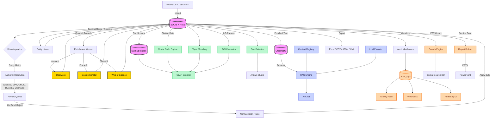

<div align="center">

# UKIP

**Universal Knowledge Intelligence Platform**

[](https://www.python.org/)
[](https://fastapi.tiangolo.com/)
[](https://react.dev/)
[](https://nextjs.org/)
[](https://tailwindcss.com/)
[](https://duckdb.org/)
[](https://www.trychroma.com/)
[](backend/tests/)
[](LICENSE)

A domain-agnostic intelligence platform that ingests raw data, harmonizes it, enriches it against global knowledge bases, runs OLAP analytics and stochastic simulations, and lets you query everything through a RAG-powered AI assistant.

[Features](#features) · [Quick Start](#quick-start) · [Architecture](#architecture) · [API](#api-overview) · [Roadmap](#roadmap) · [Strategic Vision](docs/EVOLUTION_STRATEGY.md)

</div>

---

## Why UKIP?

Most data platforms force you to choose: clean your data **or** analyze it. UKIP does both in a single pipeline. It started as a catalog deduplication tool and evolved into a full research intelligence engine across 59 development sprints.

**What it does:**

1. **Ingest** any structured data (Excel, CSV, JSON-LD, XML, BibTeX, RIS, Parquet).
2. **Harmonize** messy records with fuzzy matching, authority resolution against 5 global knowledge bases (Wikidata, VIAF, ORCID, DBpedia, OpenAlex), and bulk normalization rules.
3. **Enrich** every record against academic APIs (OpenAlex, Google Scholar, Web of Science).
4. **Analyze** with OLAP cubes (DuckDB), Monte Carlo simulations, topic modeling, correlation analysis, and I+D ROI projections.
5. **Query** your entire dataset in natural language through a RAG assistant powered by any LLM provider.
6. **Collaborate** through threaded comments on any entity or authority record, with full RBAC and edit/delete controls.
7. **Observe** every action through a real-time activity feed, persistent audit log with HTTP-level tracking, and outbound webhooks.
8. **Manage users and profiles** — role-based user management, per-user avatar, display name, bio, and a dedicated self-service profile page accessible to all roles.

### Design Philosophy

One rule: **Justified Complexity** ([details](docs/ARCHITECTURE.md)).

- Monorepo (FastAPI + Next.js). No microservices until proven necessary.
- If a dictionary solves it, we use a dictionary.
- Accessible for beginners, robust for production data tasks.

---

## Features

### Data Operations
- **Entity Catalog** — Browse, search, inline-edit, and delete records across any domain. Dynamic pagination, structured identifier fields, FTS5 full-text search.
- **Entity Detail Page** — Dedicated route (`/entities/:id`) with four tabs: Overview (inline editing), Enrichment (Monte Carlo chart + concepts), Authority (candidate review with confirm/reject), and **Comments** (threaded team annotations).
- **Entity Linker** — Fuzzy pairwise duplicate detection across the catalog. Brand-blocked O(n²) scan with configurable similarity threshold. Side-by-side field comparison, merge (winner absorbs loser's null fields) and dismiss (persisted in `link_dismissals`). Undo dismissals at any time.
- **Multi-format Import/Export** — Excel, CSV, JSON, XML. Drag-and-drop pre-analyzer for JSON-LD, RDF, Parquet, BibTeX, RIS.
- **Domain Registry** — Define custom schemas (Science, Healthcare, Business, or your own) with YAML-based configurations.
- **Demo Mode** — One-click seed of 1,000 demo entities; one-click wipe.

### Data Quality
- **Fuzzy Disambiguation** — `token_sort_ratio` + Levenshtein grouping of typos, casings, and synonyms.
- **Authority Resolution Layer** — Resolve entities against Wikidata, VIAF, ORCID, DBpedia, and OpenAlex. Weighted scoring engine ranks candidates by confidence. Batch resolution with review queue for bulk confirm/reject workflows.
- **Harmonization Pipeline** — Multi-step normalization with undo/redo history and change tracking.

### Analytics & Intelligence
- **OLAP Cube Explorer** — DuckDB-powered multi-dimensional queries with drill-down navigation and Excel pivot export.
- **Monte Carlo Citation Projections** — Geometric Brownian Motion model simulates 5,000 citation trajectories per record. Interactive area charts.
- **ROI Calculator** — Monte Carlo I+D projection engine. Models adoption uncertainty (Normal distribution, configurable σ) across 3–20 year horizons. Returns P5–P95 percentiles, break-even probability, year-by-year ROI trajectory, and final distribution histogram.
- **Topic Modeling** — Concept frequency, co-occurrence (PMI), topic clusters, and Cramér's V field correlations.
- **Executive Dashboard** — KPI summary cards, 7-day activity area chart, brand × year heatmap, top concepts cloud, and top entities table.
- **Knowledge Gap Detector** — Automated scan of the active domain for enrichment holes, authority backlog, concept density shortfalls, and dimension completeness. Each gap is severity-rated (critical/warning/ok) with affected entity count and a recommended action.

### Artifact Studio
- **Report Builder** — Self-contained HTML/PDF/Excel/PowerPoint reports generated server-side. Select any combination of sections: entity stats, enrichment coverage, top brands, topic clusters, harmonization log.
- **Report Templates** — DB-backed template library with 4 built-in presets (Executive Summary, Research Analysis, Data Quality Audit, Full Report). Editors can save custom templates and apply them one-click.
- **PowerPoint Export** — Branded 16:9 PPTX via `python-pptx`. Slides generated per selected section with platform accent color theming.
- **Artifact Studio Hub** (`/artifacts`) — Unified gateway showing live gap counts, template library count, and ROI projector CTA.

### Context Engineering
- **Analysis Contexts** — Snapshot and restore domain state for LLM sessions. Tag context with domain, user, and metadata.
- **Tool Registry** — Register, version, and invoke tool schemas from the UI. Audit every tool invocation.
- **Context-Aware RAG** — RAG queries enriched with active domain context and tool results.

### Collaborative Features
- **Threaded Annotations** — Comment on any entity or authority record. One-level reply threading. Edit/delete your own comments (admins can delete any). Full RBAC: editor+ to write, viewer to read.
- **Comments Tab** — Integrated directly into the entity detail page with live annotation count badge on the tab.

### Full-Text Search
- **SQLite FTS5 index** covering entities, authority records, and annotations. Prefix-match queries with user input sanitization.
- **Global search bar** in the header with debounced live dropdown (6 results) and keyboard navigation (Enter → full results page, Escape → dismiss).
- **Search page** (`/search`) with type filter pills (Entity / Authority / Annotation), ranked result cards with type icons and snippet preview, and pagination.
- **Rebuild endpoint** (`POST /search/rebuild`) re-indexes the full catalog on demand (admin+).

### Observability & Automation
- **Audit Log** — HTTP-level middleware captures every mutating request: actor (JWT sub), endpoint, method, HTTP status, IP address, and timestamp. Frontend timeline at `/audit-log` with stats bar, 7-day sparkline, filter bar (action/resource/user/date), paginated timeline, and CSV export.
- **Activity Feed** — Real-time audit timeline on the home dashboard. Auto-refreshes every 30 seconds.
- **Webhooks** — Outbound HTTP callbacks for any platform event. HMAC-SHA256 request signing, per-event subscription, fire-and-forget delivery with status tracking.
- **Notification Center** — Full `/notifications` page with per-user read/unread state (server-side `last_read_at` threshold), action links to relevant entities, filter by event type, paginated feed, bulk mark-all-read, and per-item dismiss. Bell icon shows live unread count badge.
- **Branding** — Configurable platform name, accent color, and footer text, applied throughout the UI and report/PPTX exports.

### Scientometric Enrichment
Three-phase cascading enrichment worker:

| Phase | Source | Access |
|-------|--------|--------|
| 1 | [OpenAlex](https://openalex.org/) | Free (polite `mailto:` mode) |
| 2 | Google Scholar | Scraping via rotating proxies |
| 3 | [Web of Science](https://clarivate.com/) | BYOK (institutional API key) |

### Semantic RAG Assistant
- **6 LLM providers** with BYOK support:

  | Provider | Models |
  |----------|--------|
  | OpenAI | gpt-4o, gpt-4o-mini |
  | Anthropic | claude-3.5-sonnet, claude-3-haiku |
  | DeepSeek | deepseek-chat, deepseek-reasoner |
  | xAI | grok-3, grok-3-mini |
  | Google | gemini-2.0-flash, gemini-pro |
  | Local | Any Ollama/vLLM model (free) |

- **ChromaDB** vector store with OpenAI or local `all-MiniLM-L6-v2` embeddings.
- Natural language queries return grounded, source-attributed answers with similarity scores.
- **Context-aware mode** enriches queries with active domain context and tool invocation history.

### User & Profile Management
- **User Management UI** — `/settings/users` page (super_admin only): stats cards (total/active/inactive/by role), search + role/status filters, inline role assignment, activate/deactivate toggle, and create/edit slide-over form.
- **Personal Profile Page** — `/profile` page accessible to all roles. Hero card with avatar, display name, role badge, bio, and member-since date. Sections: Profile Picture upload, Personal Information form (display name, email, bio), and Security (change password).
- **User Avatar** — Drag & drop avatar upload with canvas center-crop to 200×200 JPEG. Stored as base64 data URL. Shown in header trigger, user menu dropdown, user management table, and entity views.
- **Password Strength Indicator** — Real-time 4-segment bar (Weak → Fair → Good → Strong) with criteria checklist (length, uppercase, lowercase, number, special chars). Present on all password input fields: profile page, settings account tab, and user creation/edit form.

### Security
- **JWT authentication** with bcrypt password hashing.
- **Role-based access control** — `super_admin`, `admin`, `editor`, `viewer`.
- **Account lockout** after 5 failed login attempts (15-minute lockout window).
- **AES encryption** for sensitive credentials at rest.
- **Circuit breaker** pattern for external API resilience (CLOSED/OPEN/HALF-OPEN states).
- **Rate limiting** via SlowAPI on authentication endpoints.

### Interface
- **Responsive UI** — Full mobile support with slide-over sidebar drawer, hamburger navigation, and adaptive layouts from 320 px to 4K.
- **Dark mode** — System-aware theme with manual toggle.
- **i18n** — English and Spanish interface with per-component translation keys.

---

## Tech Stack

| Layer | Technology |
|-------|------------|
| **API** | Python 3.10+, FastAPI, SQLAlchemy ORM |
| **Database** | SQLite + FTS5 (OLTP), DuckDB (OLAP cubes), ChromaDB (vectors) |
| **Matching** | thefuzz + python-Levenshtein |
| **Enrichment** | openalex-py, scholarly, httpx |
| **Analytics** | numpy, scipy, DuckDB SQL (CUBE/ROLLUP/GROUPING SETS) |
| **NLP** | LDA topic modeling, sentence-transformers |
| **AI/RAG** | openai, anthropic, ChromaDB, sentence-transformers |
| **Export** | openpyxl (Excel), WeasyPrint (PDF), python-pptx (PowerPoint) |
| **Frontend** | Next.js 16, React 19, TypeScript 5, Tailwind CSS 4, Recharts |

---

## Quick Start

### Prerequisites
- [Python 3.10+](https://www.python.org/downloads/)
- [Node.js 18+](https://nodejs.org/)

### 1. Clone and install

```bash
git clone https://github.com/keilynrp/universal-knowledge-intelligence-platform.git
cd universal-knowledge-intelligence-platform
```

### 2. Backend

```bash
python -m venv .venv

# Windows
.venv\Scripts\activate
# macOS / Linux
source .venv/bin/activate

pip install -r requirements.txt
uvicorn backend.main:app --reload
```

API at `http://localhost:8000` — Swagger UI at `http://localhost:8000/docs`

### 3. Frontend

```bash
cd frontend
npm install
npm run dev
```

Open `http://localhost:3004`

### 4. (Optional) Configure providers

- **AI Assistant**: Go to **Integrations > AI Language Models** and add your API key. For zero-cost: install [Ollama](https://ollama.ai) and point to `http://localhost:11434/v1`.
- **Web of Science**: Set `WOS_API_KEY` as an environment variable.
- **Webhooks**: Go to **Settings > Webhooks** to register outbound endpoints and subscribe to events.

### 5. Run tests

```bash
python -m pytest backend/tests/ -x -q
# 578 tests, all passing
```

---

## Architecture



---

## API Overview

143 endpoints across 25 functional routers. Full interactive docs at `/docs` (Swagger) or `/redoc`.

### Authentication & Users
| Method | Endpoint | Description |
|--------|----------|-------------|
| `POST` | `/auth/token` | Login (OAuth2 password flow) |
| `GET` | `/users/me` | Current user profile |
| `PATCH` | `/users/me/profile` | Update display name, email, bio (any auth) |
| `POST` | `/users/me/password` | Change password (any auth) |
| `POST` | `/users/me/avatar` | Upload avatar — base64 data URL (any auth) |
| `DELETE` | `/users/me/avatar` | Remove avatar (any auth) |
| `GET` | `/users/stats` | User count stats by role/status (super_admin) |
| `POST` | `/users` | Create user (super_admin) |
| `PUT` | `/users/{id}` | Update user email, role, or status (super_admin) |
| `POST` | `/users/{id}/activate` | Reactivate a deactivated user (super_admin) |
| `DELETE` | `/users/{id}` | Soft-deactivate user (super_admin) |

### Entity Catalog
| Method | Endpoint | Description |
|--------|----------|-------------|
| `GET` | `/entities` | List entities (search, pagination, filters) |
| `GET` | `/entities/{id}` | Single entity detail |
| `POST` | `/upload` | Import file (Excel, CSV) |
| `GET` | `/stats` | Aggregated system statistics |
| `GET` | `/export` | Export data (CSV, Excel, JSON, XML) |

### Entity Linker
| Method | Endpoint | Description |
|--------|----------|-------------|
| `GET` | `/linker/candidates` | Fuzzy duplicate candidates (brand-blocked scan) |
| `POST` | `/linker/merge` | Merge loser into winner entity |
| `POST` | `/linker/dismiss` | Mark pair as not a duplicate (idempotent) |
| `GET` | `/linker/dismissals` | List dismissed pairs |
| `DELETE` | `/linker/dismissals/{id}` | Undo a dismissal |

### Full-Text Search
| Method | Endpoint | Description |
|--------|----------|-------------|
| `GET` | `/search` | FTS5 full-text search across all doc types |
| `POST` | `/search/rebuild` | Rebuild search index from catalog (admin+) |

### Domains & Schema Registry
| Method | Endpoint | Description |
|--------|----------|-------------|
| `GET` | `/domains` | List available domains |
| `POST` | `/domains` | Create custom domain schema |
| `DELETE` | `/domains/{id}` | Delete custom domain (built-ins protected) |

### Disambiguation & Harmonization
| Method | Endpoint | Description |
|--------|----------|-------------|
| `GET` | `/disambiguate/{field}` | Fuzzy-match groups for a field |
| `POST` | `/harmonization/apply` | Apply harmonization step |
| `POST` | `/harmonization/undo` | Undo last harmonization |
| `POST` | `/rules/apply` | Apply normalization rules |

### Authority Resolution
| Method | Endpoint | Description |
|--------|----------|-------------|
| `POST` | `/authority/resolve` | Resolve value against authority sources |
| `GET` | `/authority/records` | List authority candidates with filters |
| `POST` | `/authority/records/{id}/confirm` | Confirm candidate |
| `POST` | `/authority/records/{id}/reject` | Reject candidate |
| `GET` | `/authority/metrics` | ARL scoring and pipeline KPIs |

### OLAP & Analytics
| Method | Endpoint | Description |
|--------|----------|-------------|
| `GET` | `/cube/dimensions/{domain}` | Available OLAP dimensions |
| `POST` | `/cube/query` | Multi-dimensional cube query |
| `GET` | `/cube/export/{domain}` | Export pivot table to Excel |
| `GET` | `/analyzers/topics/{domain}` | Concept frequency and co-occurrence |
| `GET` | `/analyzers/clusters/{domain}` | Topic cluster analysis |
| `GET` | `/analyzers/correlation/{domain}` | Cramér's V field correlations |
| `POST` | `/analytics/roi` | Monte Carlo I+D ROI simulation |
| `GET` | `/dashboard/summary` | Executive dashboard KPIs + heatmap |

### Knowledge Gap Detector & Artifact Studio
| Method | Endpoint | Description |
|--------|----------|-------------|
| `GET` | `/artifacts/gaps/{domain_id}` | Run gap analysis (enrichment, authority, concepts, dimensions) |
| `GET` | `/artifacts/templates` | List report templates |
| `POST` | `/artifacts/templates` | Save custom template (editor+) |
| `DELETE` | `/artifacts/templates/{id}` | Delete custom template (built-ins protected) |

### Report Builder
| Method | Endpoint | Description |
|--------|----------|-------------|
| `GET` | `/reports/sections` | List available report sections |
| `POST` | `/reports/generate` | Generate HTML report |
| `POST` | `/exports/pdf` | Export report as PDF (WeasyPrint) |
| `POST` | `/exports/excel` | Export branded 4-sheet workbook |
| `POST` | `/exports/pptx` | Export branded 16:9 PowerPoint (python-pptx) |

### Scientometric Enrichment
| Method | Endpoint | Description |
|--------|----------|-------------|
| `POST` | `/enrich/bulk` | Queue bulk enrichment |
| `GET` | `/enrich/stats` | Enrichment KPIs and concept cloud |
| `GET` | `/enrich/montecarlo/{id}` | Monte Carlo 5-year citation projection |

### Semantic RAG
| Method | Endpoint | Description |
|--------|----------|-------------|
| `POST` | `/rag/index` | Vectorize catalog into ChromaDB |
| `POST` | `/rag/query` | Natural language query |
| `GET` | `/rag/stats` | Vector store statistics |

### Annotations (Collaborative Comments)
| Method | Endpoint | Description |
|--------|----------|-------------|
| `GET` | `/annotations` | List annotations (filter by entity or authority) |
| `POST` | `/annotations` | Create annotation or reply |
| `PUT` | `/annotations/{id}` | Edit annotation (own or admin) |
| `DELETE` | `/annotations/{id}` | Delete annotation (own or admin) |

### Context Engineering & Tool Registry
| Method | Endpoint | Description |
|--------|----------|-------------|
| `GET` | `/context/sessions` | List analysis sessions |
| `POST` | `/context/sessions` | Create context snapshot |
| `GET` | `/context/tools` | List registered tools |
| `POST` | `/context/tools` | Register tool schema |
| `POST` | `/context/tools/{id}/invoke` | Invoke tool and log result |

### Notification Center
| Method | Endpoint | Description |
|--------|----------|-------------|
| `GET` | `/notifications/center` | Paginated feed with `is_read` flag per entry (any auth) |
| `GET` | `/notifications/center/unread-count` | Fast unread count for bell badge (any auth) |
| `POST` | `/notifications/center/read-all` | Mark all entries read up to now (any auth) |

### Audit Log
| Method | Endpoint | Description |
|--------|----------|-------------|
| `GET` | `/audit-log` | Paginated audit timeline (admin+) |
| `GET` | `/audit-log/stats` | Activity stats — by action, resource, top users, 7-day chart |
| `GET` | `/audit-log/export` | Download audit log as CSV (admin+) |

### Demo Mode
| Method | Endpoint | Description |
|--------|----------|-------------|
| `GET` | `/demo/status` | Check demo data status |
| `POST` | `/demo/seed` | Seed 1,000 demo entities (admin+) |
| `DELETE` | `/demo/reset` | Wipe all demo entities (admin+) |

### Webhooks
| Method | Endpoint | Description |
|--------|----------|-------------|
| `GET` | `/webhooks` | List configured webhooks |
| `POST` | `/webhooks` | Register a new webhook |
| `PUT` | `/webhooks/{id}` | Update webhook (url, events, secret) |
| `DELETE` | `/webhooks/{id}` | Remove webhook |
| `POST` | `/webhooks/{id}/test` | Send a test ping to endpoint |

### AI Provider Management
| Method | Endpoint | Description |
|--------|----------|-------------|
| `GET` | `/ai-integrations` | List configured LLM providers |
| `POST` | `/ai-integrations` | Add provider (BYOK) |
| `POST` | `/ai-integrations/{id}/activate` | Set active RAG provider |

---

## Project Structure

<details>
<summary>Click to expand</summary>

```
ukip/
├── backend/
│   ├── adapters/                  # Store + enrichment + LLM adapters
│   ├── analytics/
│   │   ├── rag_engine.py          # RAG orchestration (index + query)
│   │   └── vector_store.py        # ChromaDB vector store
│   ├── analyzers/
│   │   ├── topic_modeling.py      # Concept frequency, co-occurrence, PMI
│   │   ├── correlation.py         # Cramér's V multi-variable analysis
│   │   ├── roi_calculator.py      # Monte Carlo I+D ROI simulation
│   │   └── gap_detector.py        # Knowledge gap analysis engine
│   ├── authority/
│   │   ├── resolver.py            # Parallel authority resolution (5 sources)
│   │   ├── scoring.py             # Weighted ARL scoring engine
│   │   └── resolvers/             # Wikidata, VIAF, ORCID, DBpedia, OpenAlex
│   ├── domains/                   # YAML domain schemas
│   ├── exporters/
│   │   ├── excel_exporter.py      # Branded 4-sheet Excel workbook
│   │   └── pptx_exporter.py       # Branded 16:9 PowerPoint (python-pptx)
│   ├── routers/                   # 25 domain routers (143 endpoints)
│   │   ├── ai_rag.py              # RAG index/query/stats
│   │   ├── analytics.py           # Dashboard, OLAP, ROI, topic analyzers
│   │   ├── annotations.py         # Collaborative threaded comments
│   │   ├── artifacts.py           # Gap detector + report templates
│   │   ├── audit_log.py           # Audit timeline, stats, CSV export
│   │   ├── auth_users.py          # JWT auth + RBAC + avatar + profile endpoints
│   │   ├── authority.py           # Authority resolution + review queue
│   │   ├── branding.py            # Platform branding settings
│   │   ├── context.py             # Context sessions + tool registry
│   │   ├── demo.py                # Demo seed/reset
│   │   ├── disambiguation.py      # Fuzzy field grouping + rules
│   │   ├── domains.py             # Domain schema CRUD
│   │   ├── entities.py            # Entity CRUD + pagination
│   │   ├── entity_linker.py       # Duplicate detection + merge/dismiss
│   │   ├── harmonization.py       # Normalization pipeline (undo/redo)
│   │   ├── ingest.py              # File upload + export
│   │   ├── notifications.py       # Notification center (read/unread state)
│   │   ├── reports.py             # HTML/PDF/Excel/PPTX report generation
│   │   ├── search.py              # FTS5 global search + index rebuild
│   │   ├── stores.py              # E-commerce connector management
│   │   └── webhooks.py            # Outbound webhook CRUD + delivery
│   ├── tests/                     # 629 tests across 35 files
│   ├── audit.py                   # AuditMiddleware (HTTP-level interception)
│   ├── auth.py                    # JWT + RBAC + account lockout
│   ├── circuit_breaker.py         # External API resilience
│   ├── encryption.py              # Fernet credential encryption
│   ├── main.py                    # FastAPI app (slim orchestrator)
│   ├── models.py                  # SQLAlchemy ORM (19 tables)
│   ├── olap.py                    # DuckDB OLAP engine
│   ├── report_builder.py          # Section builders for reports
│   └── schema_registry.py         # Dynamic domain schema loader
├── frontend/
│   ├── app/
│   │   ├── analytics/
│   │   │   ├── dashboard/         # Executive Dashboard (KPIs, heatmap, top entities)
│   │   │   ├── olap/              # OLAP Cube Explorer
│   │   │   ├── topics/            # Topic Modeling & Correlations
│   │   │   ├── roi/               # ROI Calculator (Monte Carlo I+D)
│   │   │   └── page.tsx           # Intelligence Dashboard hub
│   │   ├── artifacts/
│   │   │   ├── gaps/              # Knowledge Gap Detector
│   │   │   └── page.tsx           # Artifact Studio hub
│   │   ├── audit-log/             # Audit Log timeline + CSV export
│   │   ├── authority/             # Authority review queue
│   │   ├── context/               # Context Engineering + Tool Registry
│   │   ├── disambiguation/        # Fuzzy disambiguation tool
│   │   ├── domains/               # Domain schema designer
│   │   ├── entities/
│   │   │   ├── [id]/              # Entity Detail (Overview · Enrichment · Authority · Comments)
│   │   │   └── link/              # Entity Linker (duplicate detection + merge)
│   │   ├── harmonization/         # Data cleaning workflows
│   │   ├── integrations/          # Store + AI provider config
│   │   ├── notifications/         # Notification Center (read/unread, action links, bulk read)
│   │   ├── profile/               # Personal Profile page (avatar, info, bio, password)
│   │   ├── rag/                   # Semantic RAG chat
│   │   ├── reports/               # Report Builder (HTML/PDF/Excel/PPTX)
│   │   ├── search/                # Full-text search results page
│   │   ├── settings/
│   │   │   ├── page.tsx           # App settings (preferences, account, webhooks, branding)
│   │   │   └── users/             # User Management (stats, search, role/status management)
│   │   └── components/
│   │       ├── AnnotationThread.tsx   # Threaded comments with RBAC
│   │       ├── ActivityFeed.tsx       # Real-time audit timeline
│   │       ├── AvatarUpload.tsx       # Drag & drop avatar upload with canvas crop
│   │       ├── ConceptCloud.tsx       # Shared concept visualization
│   │       ├── DisambiguationTool.tsx # Fuzzy cluster resolver
│   │       ├── EntityTable.tsx        # Entity list with detail links
│   │       ├── MonteCarloChart.tsx    # Citation projection chart
│   │       ├── NotificationBell.tsx   # Bell icon with live unread count badge
│   │       ├── PasswordStrength.tsx   # Real-time password strength bar + criteria checklist
│   │       ├── RAGChatInterface.tsx   # AI chat with source attribution
│   │       ├── UserAvatar.tsx         # Shared avatar: image or role-colored initials fallback
│   │       └── ui/                    # Shared design system (TabNav, Badge, PageHeader…)
│   └── lib/                       # apiFetch API client
├── data/demo/
│   └── demo_entities.xlsx         # 1,000 sample entities for demo mode
├── docs/
│   ├── ARCHITECTURE.md
│   ├── EVOLUTION_STRATEGY.md      # Phase 6–11 platform vision
│   └── SCIENTOMETRICS.md
└── requirements.txt
```

</details>

---

## Roadmap

### Completed ✅

| Sprints | Phase | Milestone |
|---------|-------|-----------|
| 1–5 | Core | Entity catalog, fuzzy disambiguation, multi-format import/export, analytics dashboard, security hardening |
| 6–9 | Enrichment | Scientometric enrichment pipeline (OpenAlex → Scholar → WoS), circuit breaker, Monte Carlo citation projections |
| 10 | RAG | Semantic RAG with ChromaDB + multi-LLM BYOK panel (6 providers) |
| 11–13 | Integrations | E-commerce adapters (Shopify, WooCommerce, Bsale); HTTP 201 on creation; export/upload caps; pagination bounds |
| 14 | Security | JWT auth on all GET endpoints, RBAC (4 roles), account lockout, password management, role-aware UI |
| 15–16 | Authority | Authority Resolution Layer: 5 resolvers, weighted ARL scoring, evidence tracking, cross-source deduplication |
| 17a | Domains | Domain Registry with YAML-based schema designer (built-ins + custom) |
| 17b | OLAP | OLAP Cube Explorer powered by DuckDB (multi-dimensional queries, drill-down, Excel pivot export) |
| 18 | Analytics | Topic modeling, PMI co-occurrence networks, topic clusters, Cramér's V correlation analysis |
| 19 | Authority | ARL Phase 2: batch resolution, review queue, bulk confirm/reject, `/authority/metrics` |
| 20–22 | Platform | Webhook system (HMAC-SHA256, per-event subscription); Audit Log + Activity Feed; responsive UI (mobile) |
| 23 | Entity UX | Entity Detail Page `/entities/:id` — 3-tab view: Overview (inline edit), Enrichment (MC chart), Authority |
| 36 | Architecture | API routers refactor — split 3,370-line `main.py` into 12 domain routers |
| 37 | Analytics | ROI Calculator — Monte Carlo I+D with P5–P95, break-even probability, year-by-year charts |
| 39 | Dashboard | Executive Dashboard — KPI cards, 7-day area chart, brand × year heatmap, concept cloud |
| 40 | Export | Enterprise export — branded Excel (4-sheet workbook), PDF via WeasyPrint |
| 41 | Demo | Demo Mode — one-click seed of 1,000 entities, one-click wipe |
| 42 | Collaboration | Collaborative Annotations — threaded comments on entities and authority records with RBAC |
| 43 | Platform | In-app Notification System — bell indicator, notification settings |
| 44 | Branding | Platform Branding — configurable name, accent color, footer text applied across UI and exports |
| 45 | Artifacts | Knowledge Gap Detector — 4-check scan (enrichment, authority, concepts, dimensions), severity rating |
| 46 | Artifacts | Strategic Report Templates — 4 built-in presets, custom template CRUD, one-click populate |
| 47 | Artifacts | Artifact Studio Hub + PowerPoint Export — branded PPTX via python-pptx, `/artifacts` hub page |
| 48 | Context | Context Engineering — analysis context snapshots, sessions, domain metadata |
| 49 | Context | Tool Registry — register, version, and invoke tool schemas; invocation audit log |
| 50 | RAG | Context-Aware RAG — queries enriched with active domain context and tool history |
| 51 | Observability | Audit Log Backend — `AuditMiddleware` captures HTTP-level mutations; new columns on `audit_logs` |
| 52 | Observability | Audit Log Frontend — stats bar, 7-day sparkline, filter bar, timeline, CSV export at `/audit-log` |
| 53 | Search | Full-Text Search — SQLite FTS5 index, global search bar in Header (live dropdown), `/search` page |
| 54 | Entity UX | Comments Tab — 4th tab on Entity Detail page, live annotation count badge, `AnnotationThread` |
| 55 | Data Quality | Entity Linker — fuzzy duplicate detection, side-by-side merge, dismiss with undo |
| 56 | Notifications | Notification Center — `/notifications` page, per-user read/unread state (`UserNotificationState`), action links, bulk mark-all-read, filter by event type |
| 57 | Users | User Management UI — `/settings/users` with stats cards, search + filters, inline role assignment, activate/deactivate, create/edit slide-over |
| 58 | Users | User Avatar Upload — drag & drop, canvas center-crop to 200×200 JPEG, base64 storage, shown in header, menu, and user table |
| 59 | Users | Personal Profile Management — `display_name` + `bio` fields, `PATCH /users/me/profile`, dedicated `/profile` page (all roles), password strength indicator on all password fields |

### Up Next 🔜

| Priority | Sprint | Feature |
|----------|--------|---------|
| High | 60 | **Webhooks UI Panel** — Visual webhook manager: create, test, view delivery history and last status |
| Medium | 61 | **Scheduled Imports** — Cron-based automated ingestion from configured store connections |
| Medium | 62 | **Bulk Entity Editor** — Multi-select in the entity list, batch field updates, bulk delete |
| Low | 63 | **Scopus Adapter** — Elsevier premium enrichment (BYOK institutional API key) |
| Low | 64 | **PostgreSQL/MySQL backends** — Swap SQLite for production-grade database via `DATABASE_URL` env var |
| Low | 65 | **SSO Integration** — OAuth2/SAML for institutional deployments |

See [EVOLUTION_STRATEGY.md](docs/EVOLUTION_STRATEGY.md) for the full platform vision and phased roadmap (Phases 6–11).

---

## Contributing

Contributions are welcome. See [Contributing Guidelines](docs/CONTRIBUTING.md) for details.

## License

[Apache License 2.0](LICENSE)
