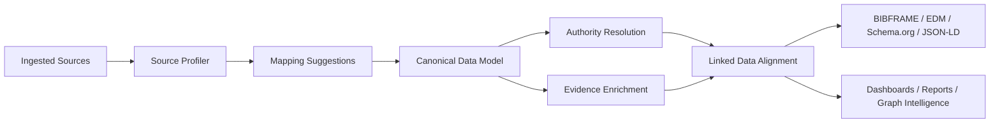

# UKIP

**Universal Knowledge Intelligence Platform**


UKIP is a research intelligence platform for ingesting, normalizing, enriching, reconciling, exploring, and reporting on knowledge datasets. It is built around a governed semantic canonical layer: source data is profiled, mapped into canonical entities, resolved against authority registries, enriched with evidence, and surfaced through dashboards, graph analytics, and executive reports.

The current product focus is scientific and institutional intelligence: publications, authors, affiliations, organizations, concepts, citations, geographic context, semantic signals, and stakeholder-ready decision support.

> [!NOTE]
> UKIP is an advanced product prototype moving toward production readiness. Core ingestion, enrichment, analytics, dashboards, and reporting flows are functional today. Architecture, data governance, and enterprise-readiness work are tracked through OpenSpec.

---

## Why UKIP

Research organizations need more than raw bibliographic records. They need trustworthy intelligence that can explain where evidence came from, which entities were reconciled, what was enriched externally, and how strategic claims were produced.

UKIP supports that workflow end-to-end:

- Ingest heterogeneous sources: files (CSV, Excel, BibTeX, RIS), scientific APIs, and connector payloads.
- Profile source structures before mapping them into the canonical model.
- Preserve original values, provenance, and field states at every transformation step.
- Normalize entities into a semantic canonical model with labels, domains, entity types, canonical IDs, attributes, quality scores, and enrichment state.
- Reconcile institutions, people, places, and scholarly objects against authority sources (Wikidata, VIAF, ORCID, OpenAlex, DBpedia, ROR).
- Enrich records with evidence from trusted scientific providers.
- Align outputs with linked-data standards (BIBFRAME, Europeana EDM, schema.org, JSON-LD, DCAT).
- Generate dashboards, graph analytics, and executive reports for research stakeholders.

---

## Architecture



```text
backend/                 FastAPI API server
  routers/               64 route modules, 388 endpoints
  services/              45+ domain services
  authority/             19 modules: resolution, scoring, normalization, caching, benchmarking, 5 resolver plugins
  analyzers/             13 analyzers: topics, correlation, coauthorship, geographic, trends, etc.
  adapters/enrichment/   8 adapters: OpenAlex, Crossref, PubMed, WoS, Scopus, Semantic Scholar, DBLP, Scholar
  cache/                 distributed cache layer: Redis backend + in-process fallback, fail-open
  domains/               3 configurable schemas: default, science, healthcare
  tests/                 182 test files, 2537 tests
frontend/                Next.js 16 App Router
  app/                   61 pages, 93 components, 8 context providers
  i18n/                  EN / ES localization
engine/                  Rust gRPC engine for high-throughput graph and text operations
alembic/                 Database migrations
openspec/                Capability specs and architecture governance
docs/                    Architecture, product, operating, and onboarding documentation
docker/                  Container entrypoints
scripts/                 Utility and maintenance scripts
```

### Enterprise Architecture Domains

UKIP manages major product and implementation decisions as architecture decisions across seven domains:

| Domain | Scope |
| --- | --- |
| Business & Stakeholder | Strategic goals, research stakeholder needs, demo flows |
| Data & Semantic | Canonical model, provenance layers, linked-data alignment |
| Application & Service | API design, service boundaries, router decomposition |
| UX/UI Experience | Dashboards, entity views, graph screens, reporting surfaces |
| Infrastructure & Operations | Docker, Dokploy, migrations, monitoring |
| Security, Privacy & Compliance | JWT/RBAC auth, encryption, rate limiting, SSO |
| GenAI Cross-Cutting | AI-assisted mapping, enrichment governance, RAG skills |

---

## Core Capabilities

| Area | What UKIP Does |
| --- | --- |
| **Ingestion** | Imports CSV, Excel, BibTeX, RIS, API, demo, and connector-oriented records with source profiling and AI-assisted field mapping. |
| **Canonical Data** | Stores universal entities with labels, domain, entity type, canonical IDs, attributes, quality scores, provenance, and enrichment state. |
| **Scientific Enrichment** | Uses OpenAlex as primary provider plus Crossref, PubMed, Web of Science, Scopus, Semantic Scholar, DBLP, and controlled Scholar fallback. Circuit breaker protection on all external calls. |
| **Authority Resolution** | Resolves authors, institutions, affiliations, and publications against Wikidata, VIAF, ORCID, OpenAlex, DBpedia, and ROR. Weighted scoring engine with configurable thresholds. NIL detection and coauthor signals. |
| **Disambiguation** | Blocking-based entity disambiguation with semantic clustering and AI-assisted resolution. Eval harness with F1=0.909. |
| **Graph Intelligence** | Materializes bibliometric and semantic relationships: authorship, same-as, related-to, co-word, semantic-neighbor, and emerging-from. Coauthorship network analysis. |
| **Analytics** | Executive dashboards, topic modeling, OLAP-style cross-tabulations, researcher analytics, trend analysis, geographic distribution, domain health scoring. |
| **Reporting** | HTML, PDF (WeasyPrint), Excel, and PowerPoint exports. Stakeholder-oriented summaries and evidence-traceable intelligence narratives. |
| **Governance** | Source profiling, field correspondence rules, mapping suggestions, readiness assessments, JSON-LD export, and OpenSpec-driven architecture governance. |
| **Distributed Cache** | Optional Redis-backed cache (authority resolver, thresholds, feedback priors, derived-status, analytics) — cross-worker coherent and deploy-surviving, fail-open, with automatic in-process fallback when `REDIS_URL` is unset. |
| **Agentic Features** | Research chat assistant, RAG skill execution, natural language query (NLQ), assistant actions, and GenAI-governed mapping suggestions. |

---

## Tech Stack

| Layer | Technology |
| --- | --- |
| Backend API | Python 3.11+, FastAPI, Pydantic v2, SQLAlchemy |
| Database | PostgreSQL (production), SQLite (local/test), DuckDB (OLAP), ChromaDB (RAG) |
| Caching | Redis (distributed, optional via `REDIS_URL`) with automatic in-process `cachetools` fallback |
| Migrations | Alembic |
| Auth | JWT + RBAC (super_admin / admin / editor / viewer), SSO via Authlib, rate limiting via SlowAPI |
| Frontend | Next.js 16, React 19, TypeScript 5, Tailwind CSS 4, Recharts, D3 |
| Engine | Rust, Tokio, tonic gRPC, sqlx |
| Analytics | pandas, DuckDB, PyArrow, NumPy, SciPy |
| Testing | pytest (2537 tests), Vitest, Playwright |
| Deployment | Docker Compose, GHCR images, Dokploy-oriented production compose |
| Monitoring | Sentry (opt-in), structured logging |

---

## Getting Started

### Prerequisites

- Python 3.11 or 3.12
- Node.js 20+
- npm
- Docker and Docker Compose (recommended for PostgreSQL-first local development)
- Rust toolchain (only needed when working on `engine/`)

### Environment

Copy the example environment file and fill in secrets:

```bash
cp .env.example .env
```

Required variables:

| Variable | Purpose |
| --- | --- |
| `ADMIN_USERNAME` | Bootstrap admin username |
| `ADMIN_PASSWORD` | Bootstrap admin password (plain, first boot only) |
| `JWT_SECRET_KEY` | JWT signing key |
| `SESSION_SECRET_KEY` | Session signing key |
| `ENCRYPTION_KEY` | Fernet key for DB credential encryption |
| `DATABASE_URL` | Database connection string |
| `ALLOWED_ORIGINS` | CORS origins (comma-separated) |

Optional enrichment variables: `OPENALEX_EMAIL`, `WOS_API_KEY`, `SCOPUS_API_KEY`, `OPENAI_API_KEY`, `S2_API_KEY`, `NCBI_API_KEY`.

Optional cache variables: `REDIS_URL` (enables the distributed cache; unset ⇒ in-process caches), `UKIP_CACHE_PREFIX`, `UKIP_CACHE_CONNECT_TIMEOUT`, `UKIP_CACHE_SOCKET_TIMEOUT`.

### Backend

```bash
python -m venv .venv
source .venv/bin/activate        # Linux/macOS
# .venv\Scripts\Activate.ps1     # Windows PowerShell

pip install -r requirements.txt -c requirements.lock
alembic upgrade head
uvicorn backend.main:app --reload --port 8000
```

API docs: [http://localhost:8000/docs](http://localhost:8000/docs)

### Frontend

```bash
cd frontend
npm install
npm run dev
```

Frontend: [http://localhost:3004](http://localhost:3004)

### Docker Compose

```bash
# Full local stack with PostgreSQL
docker compose up -d

# Development mode
docker compose -f docker-compose.dev.yml up -d

# Production (Dokploy)
docker compose -f docker-compose.prod.yml up -d
```

The production compose includes a co-located `ukip-redis` service that activates the distributed cache out of the box (`REDIS_URL` defaults to `redis://ukip-redis:6379/0`, overridable to a managed instance).

---

## Testing

```bash
# Run all backend tests
pytest backend/tests -q

# With coverage
pytest backend/tests --tb=short --cov=backend --cov-report=term-missing -q

# Frontend unit tests
cd frontend && npm test

# Frontend E2E
cd frontend && npm run e2e

# TypeScript check
cd frontend && npx tsc --noEmit
```

**Current test stats:** 2537 backend tests across 182 test files (2530 passing, 7 skipped).

---

## API Overview

388 endpoints organized across 64 route modules:

| Module Group | Routes | Description |
| --- | --- | --- |
| `auth_users` | Auth, users, RBAC, SSO, API keys | Authentication and user management |
| `ingest`, `ingest_helpers` | Upload, preview, analyze, mapping | Data ingestion pipeline |
| `entities`, `search` | CRUD, filtering, full-text search | Entity management |
| `domains` | Schema registry | Domain configuration |
| `analytics`, `analytics_analyzers`, `analytics_ops` | Dashboards, topics, OLAP, trends | Analytics engine |
| `authority`, `authority_institutions`, `authority_records` | Resolution, reconciliation, records | Authority resolution layer |
| `governance_sources`, `governance_field_correspondence*` | Profiling, rules, operations | Data governance |
| `disambiguation` | Clustering, AI resolution | Entity disambiguation |
| `harmonization`, `transformations` | Rules, apply, undo/redo | Data harmonization |
| `coauthorship`, `relationships`, `entity_linker` | Graph, networks, linking | Relationship intelligence |
| `reports`, `graph_export`, `sales_deck` | PDF, Excel, PPTX, graph export | Reporting and export |
| `enrichment_schedule`, `stores`, `webhooks` | Scheduling, connectors, hooks | Integration layer |
| `agentic_chat`, `ai_rag`, `nlq`, `assistant_actions` | Chat, RAG, NLQ, actions | AI-powered features |
| `demo`, `onboarding`, `workspace_reset` | Seed data, guided setup, reset | Platform operations |

---

## Product Surfaces

### Frontend Pages (61 pages)

| Surface | Path | Description |
| --- | --- | --- |
| Home | `/` | Operational overview and quick actions |
| Executive Dashboard | `/analytics/dashboard` | KPIs, timelines, heatmaps, concept clouds |
| Graph Intelligence | `/analytics/graph` | Interactive relationship graph |
| Topic Analysis | `/analytics/topics` | Co-occurrence, clusters, correlations |
| OLAP Explorer | `/analytics/olap` | Dimensional cross-tabulation |
| Researcher Analytics | `/analytics/researchers` | Author metrics, collaboration networks |
| Entity Browser | `/entities` | Filterable entity list with grouped view |
| Entity Detail | `/entities/[id]` | Provenance, enrichment, authority, relationships |
| Import Wizard | `/import` | Guided data ingestion with mapping |
| Domain Registry | `/domains` | Schema designer for custom domains |
| Reports | `/reports` | Multi-format report generation |
| Catalogs | `/catalogs` | Curated entity collections |
| Governance | `/governance` | Field correspondence rules and source profiles |
| Authority | `/authority` | Resolution queue and reconciliation |
| Research Chat | `/assistant` | Agentic research conversation interface |

### Backend Services (45+ services)

Key service modules:

- **`graph_materializer.py`** — Materializes bibliometric and semantic relationships
- **`semantic_keyword_signal_engine.py`** — Keyword and opportunity signal generation
- **`analytics_service.py`** — Dashboard and analytics read logic
- **`institution_reconciliation.py`** — ROR-based institution matching
- **`geographic_reconciliation.py`** — Geographic entity resolution
- **`agentic_research_chat.py`** — AI-powered research conversation
- **`evidence_traceability.py`** — Provenance chain tracking
- **`source_profiler.py`** — Source structure analysis
- **`field_correspondence.py`** — Governance rule engine
- **`enrichment_scheduler.py`** — Background enrichment orchestration

---

## Authority Resolution

UKIP resolves entities against six external authority sources:

| Source | Entity Types | Identifier |
| --- | --- | --- |
| Wikidata | People, organizations, concepts, places | Q-ID |
| VIAF | Authors, organizations | VIAF ID |
| ORCID | Researchers | ORCID iD |
| OpenAlex | Authors, institutions, works, concepts | OpenAlex ID |
| DBpedia | General entities | DBpedia URI |
| ROR | Research institutions | ROR ID |

The resolution pipeline includes:

- **Weighted scoring engine** (0.35 identifiers + 0.25 name + 0.20 affiliation + 0.10+0.10 reserved)
- **Dynamic weight renormalization** when context is absent
- **Resolution statuses**: exact_match (>=0.85), probable_match (>=0.65), ambiguous (>=0.45), unresolved (<0.45)
- **NIL detection** for entities with no authority match
- **Coauthor signal boosting** for improved author resolution
- **Batch resolution** with async job queue

---

## Enrichment Adapters

| Adapter | Source | Type |
| --- | --- | --- |
| `openalex.py` | OpenAlex | Primary, open-access metadata |
| `crossref.py` | Crossref | DOI resolution and metadata |
| `pubmed.py` | PubMed / NCBI | Biomedical literature |
| `wos.py` | Web of Science | Citation indexes |
| `scopus.py` | Scopus / Elsevier | Abstract and citation database |
| `semantic_scholar.py` | Semantic Scholar | AI-curated research corpus |
| `dblp.py` | DBLP | Computer science bibliography |
| `scholar.py` | Google Scholar | Fallback (disabled by default) |

All adapters are protected by a circuit breaker (3/5 failure threshold, 60s/120s recovery).

---

## Domain Schemas

UKIP supports configurable domain schemas via YAML:

| Domain | Primary Entity | Use Case |
| --- | --- | --- |
| `default` | Generic entity | General-purpose knowledge management |
| `science` | Publication | Scientific and bibliometric intelligence |
| `healthcare` | Clinical entity | Healthcare data governance |

Custom domains can be created through the Domain Registry UI (`/domains`).

---

## Security

| Feature | Implementation |
| --- | --- |
| Authentication | JWT tokens via OAuth2 password flow |
| Authorization | Role-based: super_admin, admin, editor, viewer |
| SSO | Authlib integration for external identity providers |
| Encryption | Fernet symmetric encryption for stored credentials |
| Rate Limiting | SlowAPI per-endpoint throttling |
| Account Lockout | 5-failure threshold, 15-minute lockout |
| CORS | Configurable allowed origins |
| Input Validation | Pydantic v2 schema validation on all endpoints |
| SQL Safety | Parameterized queries, identifier whitelisting for DuckDB OLAP |

---

## Documentation Map

| Document | Description |
| --- | --- |
| [Architecture](docs/ARCHITECTURE.md) | System architecture overview |
| [Technical Onboarding](docs/TECHNICAL_ONBOARDING.md) | Developer getting-started guide |
| [API Notes](docs/API.md) | API design decisions and conventions |
| [Contributing](docs/CONTRIBUTING.md) | Contribution guidelines |
| [Backend Codemap](docs/CODEMAPS/backend.md) | Backend module index |
| [Codemap Index](docs/CODEMAPS/INDEX.md) | All available codemaps |
| [Operating Docs](docs/operating/README.md) | Deployment and operations |
| [Product Docs](docs/product/README.md) | Product specifications |
| [Evolution Strategy](docs/EVOLUTION_STRATEGY.md) | Platform evolution and roadmap |
| [Implementation Roadmap](docs/IMPLEMENTATION_ROADMAP.md) | Sprint-level implementation tracking |
| [Infrastructure Operations](docs/infrastructure-operations.md) | Infrastructure runbooks |
| [Documentation Governance](docs/DOCUMENTATION_GOVERNANCE.md) | Documentation standards |
| [ADR Index](docs/adr/) | Architecture Decision Records (5 ADRs) |

---

## Architecture Decision Records

| ADR | Decision |
| --- | --- |
| [001](docs/adr/001-provenance-layering.md) | Provenance layering: separate ingestion, normalized, enrichment, authority, and audit layers |
| [002](docs/adr/002-canonical-governance.md) | Canonical data governance model |
| [003](docs/adr/003-authority-resolution.md) | Authority resolution architecture |
| [004](docs/adr/004-enrichment-circuit-breaker.md) | Circuit breaker pattern for enrichment adapters |
| [005](docs/adr/005-genai-mapping-governance.md) | GenAI-assisted mapping with governance guardrails |

---

## Production Notes

- **Database**: PostgreSQL is the preferred production database. SQLite remains useful for local development and tests.
- **Migrations**: Run `alembic upgrade head` explicitly or through the guarded backend entrypoint.
- **Enrichment**: Background enrichment worker runs on startup. Monitor circuit breaker states and adapter health in production.
- **Caching**: Set `REDIS_URL` to enable the distributed cache (cross-worker, deploy-surviving); leaving it unset keeps single-process in-process caches. Cache access is fail-open — a Redis outage degrades to cache misses, never request failures. See [Infrastructure Operations](docs/infrastructure-operations.md#distributed-cache-redis) for enable/rollback and monitoring.
- **Monitoring**: Sentry and structured logging are opt-in through environment variables.
- **Scholar**: Google Scholar fallback is disabled by default. Enable only after understanding operational and legal implications.
- **GenAI**: All AI-assisted features are grounded in evidence, provenance, confidence, and review rules.
- **Engine**: The Rust gRPC engine is optional. The platform operates fully without it; the engine provides acceleration for graph and text operations at scale.

---

## License

Proprietary. All rights reserved.
