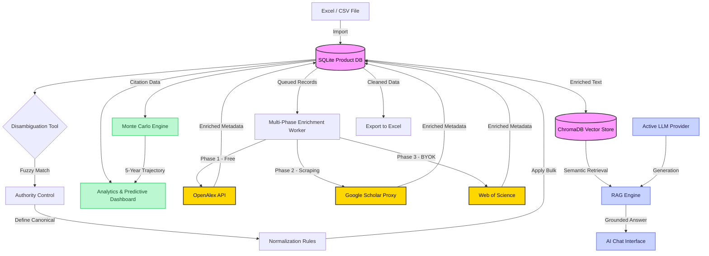

<div align="center">

# 🗄️ DB Disambiguator

**A Full-Stack Research Intelligence Platform for E-commerce & Scientific Catalog Enrichment**

[](https://www.python.org/)
[](https://fastapi.tiangolo.com/)
[](https://react.dev/)
[](https://nextjs.org/)
[](https://tailwindcss.com/)
[](https://www.trychroma.com/)
[](LICENSE)

*From raw catalog chaos to a self-enriching, AI-queryable research intelligence engine — in 5 evolutionary phases.*

[Features](#-features) • [Quick Start](#-quick-start) • [Architecture](#-workflow-architecture) • [API](#-api-overview) • [Roadmap](#%EF%B8%8F-roadmap) • [Strategic Vision](docs/EVOLUTION_STRATEGY.md)

</div>

---

## 🎯 Why DB Disambiguator?

What began as a data hygiene tool for e-commerce catalogs has evolved into a **full research intelligence platform**. The system normalizes messy product data, enriches it with scientometric metadata from premium and open academic APIs, runs stochastic simulations to predict future impact, and leverages RAG-powered LLMs to let you *query your own catalog in natural language*.

**DB Disambiguador** provides a visual interface to:
1. **Spot the mess**: Catch typos and variations using fuzzy matching.
2. **Define the truth**: Select the correct "canonical" value.
3. **Clean the database**: Apply rules to update thousands of records instantly.
4. **Enrich with science**: Map your catalog to global academic databases automatically.
5. **Predict impact**: Run Monte Carlo simulations to project future citation trajectories.
6. **Ask questions**: Talk to your catalog via a Retrieval-Augmented Generation (RAG) AI assistant.

### 🧠 Design Philosophy: Pragmatic & Accessible
As detailed in our [Architecture Documentation](docs/ARCHITECTURE.md), this codebase governs itself by one rule: **Justified Complexity**.
- We avoid over-engineering and premature abstractions.
- The repository is a straightforward **Monorepo** (FastAPI + Next.js).
- If something can be solved with a simple dictionary instead of a complex library, we use the dictionary.

*The codebase is intentionally accessible for beginners while robust enough for production data tasks. No spaghetti code, no unnecessary "astronaut architecture".*

---

## ✨ Features

### Core Data Operations
- 📦 **Interactive Product Catalog** — Browse, search, inline-edit, and delete product records. Dynamic pagination (10–100 rows), SKU/GTIN structured fields.
- 📥 **Native Excel Import & Export** — Upload `.xlsx` files preserving column formats. Export cleaned & filtered data back to Excel.
- 🔍 **Fuzzy Data Disambiguation** — `token_sort_ratio` & `Levenshtein`-powered grouping of typos, casings, and synonyms.
- 🛡️ **Authority Control & Rules Engine** — Define canonical values, create bulk normalization rules, process large variation groups.
- 📊 **Real-time Analytics Dashboard** — Key metrics: total products, unique brands/models, validation status, identifier coverage.
- 🔬 **Multi-format Pre-Analyzer** — Drag-and-Drop preview for `JSON-LD`, `XML`, `RDF triples`, `Parquet`, `BibTeX`, `RIS`, `TXT`.
- 🧹 **Database Purge** — Reset your environment cleanly (with optional rule cleanup).

### Phase 4: Predictive Scientometric Intelligence *(Active)*
- 🔮 **3-Phase Cascading Enrichment Worker** — Background queue that enriches every record against academic databases in priority order:
  - **Phase 1** — [OpenAlex](https://openalex.org/) (free, rate-limited, polite `mailto:` mode)
  - **Phase 2** — Google Scholar scraping via rotating free proxies (anti-bot fallback)
  - **Phase 3** — [Web of Science (Clarivate)](https://clarivate.com/products/scientific-and-academic-research/research-discovery-and-workflow-solutions/webofscience-platform/) via **BYOK** (Bring Your Own Key)
- 📈 **Monte Carlo Citation Projections** — Stochastic Geometric Brownian Motion model (`numpy`) simulates 5,000 future citation trajectories per record. Visualized as interactive area charts (Recharts) inside each Product Details modal.

### Phase 5: Semantic RAG — AI Assistant *(Active)*
- 🌌 **Universal LLM Integration** — Configure any frontier AI model through **Integrations → AI Language Models**:
  | Provider | Models | BYOK |
  |---|---|---|
  | OpenAI | `gpt-4o`, `gpt-4o-mini` | ✅ |
  | Anthropic (Claude) | `claude-3-5-sonnet`, `claude-3-haiku` | ✅ |
  | DeepSeek | `deepseek-chat`, `deepseek-reasoner` | ✅ |
  | xAI (Grok) | `grok-3-mini`, `grok-3` | ✅ |
  | Google (Gemini) | `gemini-2.0-flash`, `gemini-pro` | ✅ |
  | Local (Ollama/vLLM) | Any model, any port | Free |
- 🗂️ **ChromaDB Vector Database** — Persistent local vector store. Embeddings are generated via `openai` (cloud) or `sentence-transformers / all-MiniLM-L6-v2` (local, free).
- 💬 **Semantic Chat Interface** — Ask questions about your catalog in natural language. The RAG engine retrieves the most relevant enriched records and generates grounded, source-attributed answers with similarity scores.

---

## 💻 Tech Stack

### Backend Engine
- **Language**: Python 3.10+
- **Framework**: FastAPI (High-performance async API)
- **Database**: SQLite with SQLAlchemy ORM
- **Vector Store**: ChromaDB (persistent, local)
- **Matching Engine**: `thefuzz` + `python-Levenshtein`
- **Scientometrics**: `openalex-py`, `scholarly`, `requests`
- **Analytics**: `numpy`, `scipy` (Monte Carlo simulations)
- **AI/RAG**: `openai`, `anthropic`, `sentence-transformers`

### Frontend Application
- **Framework**: Next.js 16 (App Router)
- **UI Library**: React 19
- **Language**: TypeScript 5
- **Styling**: Tailwind CSS 4
- **Charts**: Recharts (area charts, distributions)

---

## 🚀 Quick Start

### Prerequisites
- [Python 3.10+](https://www.python.org/downloads/)
- [Node.js 18+](https://nodejs.org/) & npm 9+

### 1. Clone the repository

```bash
git clone https://github.com/keilynrp/Database-disambiguator.git
cd Database-disambiguator
```

### 2. Set up Backend

```bash
# Create and activate virtual environment
python -m venv .venv

# Windows
.venv\Scripts\activate
# macOS / Linux
source .venv/bin/activate

# Install dependencies (includes AI/RAG libraries)
pip install -r requirements.txt

# Start the API server
uvicorn backend.main:app --reload
```
*The API runs at `http://localhost:8000` — Swagger UI at `http://localhost:8000/docs`*

### 3. Set up Frontend

```bash
cd frontend
npm install
npm run dev
```
*Open **[http://localhost:3004](http://localhost:3004)** in your browser.*

### 4. (Optional) Configure AI Providers

To unlock the Semantic RAG Assistant, navigate to **Integrations → 🧠 AI Language Models** and add your preferred provider API key. For a fully local, zero-cost setup — install [Ollama](https://ollama.ai) and configure `http://localhost:11434/v1` as your base URL.

> ⚡ **Premium Enrichment (WoS/Scopus):** Set your institutional API key as `WOS_API_KEY` environment variable to activate Phase 3.

---

## 🔄 Workflow Architecture



---

## 🗺️ Roadmap

| Status | Milestone |
|--------|-----------|
| ✅ | **Core Catalog Functionality** — CRUD, fuzzy match, pagination |
| ✅ | **Advanced Authority Control** — Bulk rules, client-side pagination |
| ✅ | **Analytics Dashboard** — Dataset health, coverage KPIs |
| ✅ | **Scientometric Engine (Phase 1–3)** — OpenAlex, Scholar, Web of Science |
| ✅ | **Monte Carlo Predictions (Phase 4)** — Stochastic citation projections |
| ✅ | **Semantic RAG Assistant (Phase 5)** — Multi-LLM, ChromaDB, chat UI |
| ✅ | **BYOK AI Provider Panel** — OpenAI, Claude, DeepSeek, xAI, Gemini, Local |
| 🔵 | **Analytics Visualizations II** — Heatmaps, comparative citation distributions |
| ⬜ | **Scopus Adapter** — Elsevier premium API (BYOK) |
| ⬜ | **Machine Learning Matcher** — Embedding-based semantic disambiguation |
| ⬜ | **Multi-Database Support** — PostgreSQL, MySQL backends |
| ⬜ | **Authentication & RBAC** — User accounts, SSO, role-based permissions |
| ⬜ | **Scheduled Imports** — Automate ingestion from S3 / external APIs |

---

## 🏗️ Project Structure

<details>
<summary>Click to expand folder structure</summary>

```text
DBDesambiguador/
├── backend/
│   ├── adapters/
│   │   ├── enrichment/          # Scientometric source adapters (OpenAlex, Scholar, WoS)
│   │   └── llm/                 # LLM provider adapters (OpenAI, Anthropic, Local/DeepSeek)
│   ├── analytics/
│   │   ├── montecarlo.py        # Phase 4: Stochastic citation projections
│   │   ├── rag_engine.py        # Phase 5: RAG orchestration (index + query)
│   │   └── vector_store.py      # ChromaDB vector store service
│   ├── main.py                  # FastAPI application & all endpoints
│   ├── models.py                # SQLAlchemy ORM models
│   ├── schemas.py               # Pydantic schemas
│   └── enrichment_worker.py     # Background enrichment queue
├── frontend/
│   ├── app/
│   │   ├── analytics/           # Predictive dashboard page
│   │   ├── integrations/        # Store + AI provider management
│   │   ├── rag/                 # Semantic RAG chat page
│   │   └── components/          # Shared UI components (MonteCarloChart, RAGChatInterface…)
│   └── package.json
├── scripts/
│   └── test_adapters.py         # Phase 1-3 adapter performance benchmark
├── data/                        # SQLite DB + ChromaDB vector store
├── docs/
│   ├── ARCHITECTURE.md          # Design patterns & philosophy
│   └── SCIENTOMETRICS.md        # 5-Phase enrichment strategy
└── requirements.txt
```
</details>

---

## 🔌 API Overview

The backend exposes a fully documented REST API. Explore it interactively at `/docs` *(Swagger UI)* or `/redoc`.

### Catalog
| Method | Endpoint | Description |
|--------|----------|-------------|
| `GET` | `/products` | List products (search, pagination) |
| `POST` | `/upload` | Import Excel / CSV file |
| `GET` | `/disambiguate/{field}` | Fuzzy-match groups for a field |
| `GET` | `/authority/{field}` | Disambiguation + rule annotations |
| `POST` | `/rules/apply` | Apply normalization rules to the DB |
| `GET` | `/stats` | Aggregated system stats |

### Scientometric Enrichment
| Method | Endpoint | Description |
|--------|----------|-------------|
| `GET` | `/enrich/stats` | KPIs, Concept Cloud & Citation info |
| `POST` | `/enrich/row/{id}` | Triggers single row API enrichment |
| `POST` | `/enrich/bulk` | Queues bulk records for enrichment |
| `GET` | `/enrich/montecarlo/{id}` | Monte Carlo 5-year citation projection |

### Phase 5 — Semantic RAG
| Method | Endpoint | Description |
|--------|----------|-------------|
| `POST` | `/rag/index` | Vectorize enriched catalog into ChromaDB |
| `POST` | `/rag/query` | Natural language query → grounded AI answer |
| `GET` | `/rag/stats` | Vector store index statistics |
| `DELETE` | `/rag/index` | Clear vector store index |

### AI Provider Management (BYOK)
| Method | Endpoint | Description |
|--------|----------|-------------|
| `GET` | `/ai-integrations` | List configured LLM providers |
| `POST` | `/ai-integrations` | Add a new provider (key, model, URL) |
| `PUT` | `/ai-integrations/{id}` | Update provider settings |
| `POST` | `/ai-integrations/{id}/activate` | Set as the active RAG provider |
| `DELETE` | `/ai-integrations/{id}` | Remove a provider |

*For the full reference, see [docs/API.md](docs/API.md). For the enrichment strategy, see [SCIENTOMETRICS.md](docs/SCIENTOMETRICS.md). For the long-term platform evolution plan, see [EVOLUTION_STRATEGY.md](docs/EVOLUTION_STRATEGY.md).*

---

## 🤝 Contributing

We welcome contributions! Please see our [Contributing Guidelines](docs/CONTRIBUTING.md) to learn how to propose bugfixes, new features, and improvements.

## 📄 License

This project is open-source and available under the **[Apache License 2.0](LICENSE)**.
