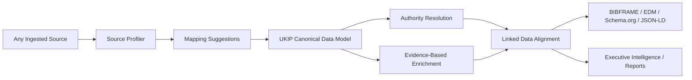

# UKIP

**Universal Knowledge Intelligence Platform**

UKIP is a research intelligence platform for ingesting, normalizing, enriching, reconciling, exploring, and reporting on knowledge datasets. It is built around a governed semantic canonical layer: source data is profiled, mapped into canonical entities, resolved against authority registries, enriched with evidence, and surfaced through dashboards, graph analytics, and executive reports.

The current product focus is scientific and institutional intelligence: publications, authors, affiliations, organizations, concepts, citations, geographic context, semantic signals, and stakeholder-ready decision support.

> [!NOTE]
> UKIP is an advanced product prototype moving toward production readiness. Core ingestion, enrichment, analytics, dashboards, and reporting flows are usable today; architecture, data governance, and enterprise-readiness work are tracked through OpenSpec.

## Why UKIP

Research organizations need more than raw bibliographic records. They need trustworthy intelligence that can explain where evidence came from, which entities were reconciled, what was enriched externally, and how strategic claims were produced.

UKIP is designed to support that workflow:

- ingest heterogeneous sources such as files, scientific APIs, and connector payloads;
- profile source structures before mapping them;
- preserve original values, provenance, and field states;
- normalize entities into a canonical semantic model;
- reconcile institutions, people, places, and scholarly objects against authority sources;
- enrich records with evidence from trusted providers;
- align outputs with linked-data standards such as BIBFRAME, Europeana EDM, schema.org, JSON-LD, DCAT, and future geospatial vocabularies;
- generate dashboards and reports for research stakeholders.

## Core Capabilities

| Area | What UKIP does |
| --- | --- |
| Ingestion | Imports CSV, Excel, BibTeX, RIS, API, demo, and connector-oriented records. |
| Canonical data | Stores universal entities with labels, domain, entity type, canonical IDs, attributes, quality, provenance, and enrichment state. |
| Scientific enrichment | Uses OpenAlex and optional providers such as Crossref, PubMed, Web of Science, Scopus, Semantic Scholar, DBLP, and controlled Scholar fallback paths. |
| Authority resolution | Supports institution, affiliation, author, publication, and geographic reconciliation patterns. |
| Graph intelligence | Materializes bibliometric and semantic relationships such as authorship, same-as, related-to, co-word, semantic-neighbor, and emerging-from. |
| Analytics | Provides executive dashboards, graph views, topic signals, OLAP-style analysis, and operational status surfaces. |
| Reporting | Produces stakeholder-oriented summaries, exports, and executive intelligence narratives. |
| Governance | Uses OpenSpec to manage enterprise architecture, semantic data governance, provenance, linked data, and strategic product evolution. |

## Architecture



```text
backend/      FastAPI API, SQLAlchemy models, routers, services, enrichment, analytics, graph, RAG
frontend/     Next.js App Router, React UI, dashboards, entity views, reports, graph screens
engine/       Rust gRPC engine for high-throughput graph and text operations
alembic/      Database migrations
openspec/     Capability specs, active changes, and architecture governance
docs/         Architecture, product, operating, roadmap, and onboarding documents
docker/       Deployment helpers and container entrypoints
scripts/      Local utility scripts
static/       Generated/static assets
```

### Enterprise Architecture Domains

UKIP now treats major product and implementation decisions as architecture decisions across seven domains:

- Business & Stakeholder Architecture
- Data & Semantic Architecture
- Application & Service Architecture
- UX/UI Experience Architecture
- Infrastructure & Operations Architecture
- Security, Privacy & Compliance
- GenAI Cross-Cutting Capability

The high-level governing spec is [`ukip-enterprise-architecture-governance`](openspec/changes/ukip-enterprise-architecture-governance/proposal.md). The data backbone is [`canonical-semantic-data-governance`](openspec/changes/canonical-semantic-data-governance/proposal.md).

## Tech Stack

| Layer | Technology |
| --- | --- |
| Backend API | Python, FastAPI, Pydantic, SQLAlchemy |
| Database | PostgreSQL for production, SQLite-compatible local/test fallback |
| Migrations | Alembic |
| Frontend | Next.js 16, React 19, TypeScript, Tailwind CSS 4 |
| Engine | Rust, Tokio, tonic gRPC, sqlx |
| Analytics/data | pandas, DuckDB, PyArrow, NumPy, SciPy, graph/materialization services |
| Testing | pytest, Vitest, Playwright, TypeScript checks |
| Deployment | Docker Compose, GHCR images, Dokploy-oriented production compose |

## Getting Started

### Prerequisites

- Python 3.11 or 3.12
- Node.js compatible with the frontend toolchain
- npm
- Docker and Docker Compose, recommended for PostgreSQL-first local development
- Rust toolchain, only needed when working directly on `engine/`

### Environment

Copy the example environment file and fill in secrets:

```powershell
Copy-Item .env.example .env
```

At minimum, set production-grade values for:

- `ADMIN_USERNAME`
- `ADMIN_PASSWORD` or `ADMIN_PASSWORD_HASH`
- `JWT_SECRET_KEY`
- `SESSION_SECRET_KEY`
- `ENCRYPTION_KEY`
- `DATABASE_URL`

Optional enrichment providers can be enabled with variables such as `OPENALEX_EMAIL`, `WOS_API_KEY`, `SCOPUS_API_KEY`, `OPENAI_API_KEY`, `S2_API_KEY`, and `NCBI_API_KEY`.

### Backend

```powershell
python -m venv .venv
.\.venv\Scripts\Activate.ps1
pip install -r requirements.txt -c requirements.lock
alembic upgrade head
uvicorn backend.main:app --reload --port 8000
```

API docs are available at:

```text
http://localhost:8000/docs
```

### Frontend

```powershell
cd frontend
npm install
npm run dev
```

The frontend runs at:

```text
http://localhost:3004
```

### Docker Compose

For a PostgreSQL-first local stack:

```powershell
docker compose up -d
docker compose logs -f ukip-backend
```

For the development compose file:

```powershell
docker compose -f docker-compose.dev.yml up -d
```

Production-oriented Dokploy deployment uses `docker-compose.prod.yml` and GHCR images configured through `.env.dokploy.example`.

## Common Commands

### Backend Tests

```powershell
pytest backend/tests -q
```

With coverage:

```powershell
pytest backend/tests --tb=short --cov=backend --cov-report=term-missing -q
```

### Frontend Checks

```powershell
cd frontend
npm exec tsc -- --noEmit --pretty false
npm test
npm run e2e
```

### OpenSpec

```powershell
npx openspec list
npx openspec validate ukip-enterprise-architecture-governance --strict
npx openspec validate canonical-semantic-data-governance --strict
```

## Active Architecture Specs

Current strategic OpenSpec changes include:

| Spec | Purpose |
| --- | --- |
| [`ukip-enterprise-architecture-governance`](openspec/changes/ukip-enterprise-architecture-governance/proposal.md) | Orchestrates enterprise architecture across business, data, services, UX/UI, infrastructure, security, and GenAI. |
| [`canonical-semantic-data-governance`](openspec/changes/canonical-semantic-data-governance/proposal.md) | Governs the semantic canonical layer and subordinate data-model specs. |
| [`geographic-entity-semantic-layer`](openspec/changes/geographic-entity-semantic-layer/proposal.md) | Adds first-class geographic entities, georeferencing, and linked-data geography. |
| [`entity-provenance-layering`](openspec/changes/entity-provenance-layering/proposal.md) | Separates original ingestion, normalized identity, enrichment, authority, and audit layers. |
| [`institution-affiliation-reconciliation`](openspec/changes/institution-affiliation-reconciliation/proposal.md) | Reconciles affiliations and institutions against ROR and secondary authorities. |
| [`scientific-affiliation-normalization`](openspec/changes/scientific-affiliation-normalization/proposal.md) | Preserves structured author-institution affiliations from scientific sources such as OpenAlex. |
| [`research-stakeholder-executive-demo`](openspec/changes/research-stakeholder-executive-demo/proposal.md) | Defines the executive research stakeholder demo and evidence traceability flow. |

Archived proposals live in [`openspec/changes/archive`](openspec/changes/archive).

## Product Surfaces

Important frontend areas:

- `/` home and operational overview
- `/analytics/dashboard` executive analytics
- `/analytics/graph` graph intelligence
- `/entities/[id]` entity detail and provenance
- reports, catalogs, enrichment, domain, and import-related workflows

Important backend areas:

- `backend/routers/` HTTP API routes
- `backend/adapters/enrichment/` external enrichment adapters
- `backend/services/analytics_service.py` dashboard and analytics read logic
- `backend/services/graph_materializer.py` graph relationship materialization
- `backend/services/semantic_keyword_signal_engine.py` semantic keyword and opportunity signal generation
- `backend/enrichment_worker.py` enrichment processing and downstream materialization hooks
- `backend/authority/` authority and reconciliation-related logic

## Documentation Map

- [Architecture](docs/ARCHITECTURE.md)
- [Technical onboarding](docs/TECHNICAL_ONBOARDING.md)
- [API notes](API.md)
- [Operating docs](docs/operating/README.md)
- [Product docs](docs/product/README.md)
- [System evaluation](docs/ukip_system_evaluation.md)
- [Enterprise roadmap](docs/UKIP_ENTERPRISE_ROADMAP.md)
- [Documentation governance](docs/DOCUMENTATION_GOVERNANCE.md)
- [Backend codemap](docs/CODEMAPS/backend.md)

## Production Notes

- PostgreSQL is the preferred production database path.
- SQLite remains useful for compatibility tests and small local scenarios.
- Production deployments should run migrations explicitly or through the guarded backend entrypoint.
- Background enrichment and scheduler behavior should be monitored carefully in production.
- Sentry and tracing are opt-in through environment variables.
- Google Scholar fallback should remain disabled by default unless operational and legal risk is understood.
- GenAI-assisted features must remain grounded in evidence, provenance, confidence, and review rules.
