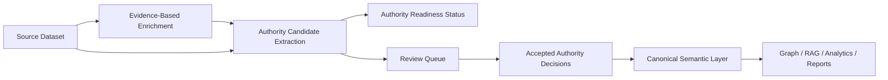

## Why

UKIP already has a meaningful authority module: it can resolve names, manage review queues, confirm/reject candidates, create normalization rules, and support author/institution authority workflows. The strategic gap is that enrichment outputs do not yet flow into authority resolution as a governed pipeline stage.

After scientific enrichment, UKIP often has stronger evidence than the original import: enriched authors, ORCID hints, affiliations, institution identifiers, DOI context, concepts, and source/provider metadata. Today those signals can remain in enrichment attributes without becoming reviewable authority candidates or canonical semantic links. That limits downstream trust in graph analytics, RAG, stakeholder reports, geographic analysis, and institutional intelligence.

This change defines the bridge between evidence-based enrichment and authority control. It makes authority readiness a visible dataset state, converts enriched evidence into reviewable candidates, and promotes accepted authority decisions into the canonical semantic layer without allowing enrichment providers to overwrite canonical identity silently.

## What Changes

- **New**: Authority candidate extraction from enriched and raw dataset evidence.
- **New**: Dataset-level authority readiness status for enriched, partially enriched, and not-yet-enriched records.
- **New**: Governed promotion rules from accepted authority records into canonical authors, institutions, affiliations, identifiers, and relationships.
- **New**: Authority review UX requirements that explain whether candidates came from source ingestion, enrichment, or existing authority records.
- **Modified**: The Authority module becomes a governed pipeline stage between enrichment and canonical semantic outputs, not only a manual disambiguation tool.

## Capabilities

### New Capabilities

- `authority-candidate-extraction`: Extract reviewable person, institution, identifier, place, venue, and concept authority candidates from source and enrichment evidence.
- `authority-readiness-status`: Expose whether a dataset/domain is ready for authority resolution and how many candidates remain unresolved.
- `authority-canonical-promotion`: Promote accepted authority decisions into canonical semantic fields and relationships with provenance.
- `authority-review-ux`: Present authority candidates, evidence, confidence, and pipeline placement clearly in the Authority module.

### Governed / Subordinate Capabilities

- `canonical-semantic-governance`
- `canonical-model-authority-boundary`
- `entity-provenance-layering`
- `scientific-affiliation-contract`
- `institution-reconciliation-service`
- `institution-authority-records`
- `geographic-entity-model`
- `rag-skill-orchestration`
- `bibliometric-graph-engine`

## Authority Bridge Flow

## Impact

- **Architecture**: Formalizes authority control as a first-class stage between enrichment and canonical semantic outputs.
- **Backend**: Requires candidate extraction services, authority status aggregation, promotion policies, and provenance-preserving persistence.
- **Frontend**: Authority screens should show readiness, candidate origin, evidence, review status, and downstream impact.
- **Data model**: Accepted candidates should populate canonical identity and relationship fields without destroying source or enrichment evidence.
- **Analytics**: Author productivity, coauthorship networks, geographic analysis, concepts, RAG, and executive reporting can rely on authority-resolved views.
- **Governance**: Prevents enrichment payloads from becoming canonical truth unless accepted by explicit rules or human review.

## Success Criteria

- A dataset with enriched authors, ORCID hints, affiliations, and DOI context can generate authority candidates automatically.
- A dataset without enrichment can still generate lower-confidence candidates from source fields and mark them as context-limited.
- Authority readiness shows counts for extracted, resolved, review-required, rejected, and not-yet-extracted candidates.
- Accepted candidates promote canonical authors, institutions, affiliations, identifiers, and relationships with provenance.
- Rejected candidates remain auditable and do not reappear unless source or enrichment evidence changes.
- Graph, RAG, analytics, and reports can prefer canonical authority-resolved values while preserving access to source and enrichment layers.
