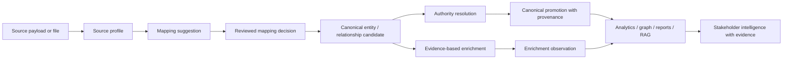

## Context

UKIP is becoming an agnostic semantic engine. Its value does not come from supporting one connector, one domain, or one schema. Its value comes from accepting heterogeneous sources, understanding their structure, proposing mappings, preserving source evidence, resolving authority identities, enriching with reliable external evidence, and producing intelligence outputs that stakeholders can trust.

Current active specs already point in this direction:

- `entity-provenance-layering` separates original ingestion, UKIP normalized identity, external enrichment, and authority/audit.
- `scientific-affiliation-normalization` preserves structured author-institution relationships from OpenAlex and similar sources.
- `institution-affiliation-reconciliation` resolves institutions against ROR and secondary authorities.
- `geographic-entity-semantic-layer` introduces first-class place semantics and linked-data geography.
- `research-stakeholder-executive-demo` exposes these capabilities to research stakeholders.

This spec defines the governance layer above them.

## Governance Baseline

### Active data-model spec inventory

| Spec | Governance role | Primary canonical concern | Required governance reference |
| --- | --- | --- | --- |
| `canonical-semantic-data-governance` | `governing` | Cross-cutting canonical lifecycle, boundaries, and linked-data alignment | Root data governance layer |
| `domain-agnostic-core-cleanup` | `governing` / `presentation` | Domain-neutral core terminology and compatibility containment | Must preserve canonical vocabulary and adapter boundaries |
| `entity-provenance-layering` | `presentation` / `canonical-specialization` | Source, normalized, enrichment, authority, and audit field grouping | Must use canonical layer names and field-state semantics |
| `scientific-affiliation-normalization` | `source-adapter` / `canonical-specialization` | Structured author, affiliation, institution, and ROR-ready metadata | Must preserve original source affiliation evidence separately from canonical candidates |
| `institution-affiliation-reconciliation` | `authority-resolver` | Institution candidates, ROR/OpenAlex/Wikidata identity, scoring, and review | Must not overwrite source affiliation text or enrichment observations |
| `geographic-entity-semantic-layer` | `canonical-specialization` / `authority-resolver` | Places, geographic identifiers, confidence, relationships, and linked-data geography | Must align place semantics to canonical provenance and linked-data rules |
| `authority-enrichment-bridge` | `authority-resolver` / `enrichment-provider` | Candidate extraction and promotion from source plus enrichment evidence | Must keep extraction, review, authority decision, and canonical promotion distinct |
| `research-stakeholder-executive-demo` | `presentation` | Stakeholder-facing decision readouts and evidence traceability | Must explain whether claims come from source, canonical, enrichment, authority, or linked-data layers |
| `rag-skill-orchestration` | `presentation` / `enrichment-provider` | Skill-assisted RAG outputs over governed evidence | Must keep AI outputs read-only unless a governed review/promotion path exists |

### Acceptance criteria for future data-model specs

Every future data-model spec SHALL declare:

- Governance role: `governing`, `canonical-specialization`, `source-adapter`, `authority-resolver`, `enrichment-provider`, or `presentation`.
- Affected canonical entities, relationships, identifiers, observations, or field states.
- Source payloads, imported fields, or provider records consumed.
- Provenance boundary: original source, normalized UKIP identity, enrichment, authority, audit, or presentation.
- Confidence and review rules, including when human review is required.
- Linked-data alignment, if outputs may be exported or used for interoperability.
- Downstream consumers affected: analytics, graph, reports, RAG, dashboards, or APIs.
- Backward-compatibility and migration expectations.

### Canonical semantic lifecycle



Lifecycle rules:

- Source profiling precedes mapping for arbitrary or unfamiliar sources.
- Mapping suggestions are reviewable artifacts, not silent canonical truth.
- Canonical identity is promoted only by governed source mapping, authority decision, or explicit review rule.
- Enrichment observations can support confidence and narrative, but remain distinguishable from authority decisions.
- Presentation layers may summarize canonical and enrichment evidence, but must not erase provenance.

## Goals / Non-Goals

**Goals:**
- Define the canonical semantic governance contract for all data-model specs.
- Require subordinate specs to declare their role and dependencies.
- Establish the lifecycle from arbitrary source to canonical model to authority/enrichment to linked-data/reporting outputs.
- Make source profiling and mapping suggestions first-class concepts.
- Preserve strict boundaries between source data, canonical identity, authority resolution, and enrichment.
- Align future exports with BIBFRAME, Europeana EDM, schema.org, JSON-LD, and other linked-data standards.

**Non-Goals:**
- Implement the full canonical database schema immediately.
- Replace existing entity storage in one migration.
- Pick a single universal ontology as UKIP's internal model.
- Require all ingested data to be bibliographic or scientific.
- Treat enrichment provider payloads as canonical truth.

## Governance Layers

### 1. Source profiling

The source profiler inspects arbitrary ingested data before mapping. It identifies:

- Field names and value distributions
- Candidate identifiers
- Candidate entity types
- Candidate relationship fields
- Candidate temporal, geographic, institutional, person, publication, dataset, and concept fields
- Field quality, sparsity, ambiguity, and sample evidence

#### Source profile artifact

Every import surface may emit a source profile artifact before canonical mapping. The profile is intentionally provider-neutral so tabular files, API payloads, connector responses, and demo datasets can use the same review surface.

```json
{
  "source_kind": "tabular | api | connector | demo",
  "source_name": "string",
  "profile_version": "1.0",
  "record_count": 0,
  "fields": [
    {
      "source_field": "authors",
      "observed_type": "string | number | boolean | date | object | array | mixed | unknown",
      "sparsity": 0.0,
      "sample_values": ["Ada Lovelace; Grace Hopper"],
      "value_distribution": {"non_empty": 0, "unique": 0, "top_values": []},
      "candidate_identifiers": [{"scheme": "orcid | doi | ror | openalex | isbn | uri | unknown", "confidence": 0.0}],
      "candidate_roles": [{"role": "person | organization | publication | dataset | place | concept | project | event | grant", "confidence": 0.0}],
      "ambiguity": {"level": "low | medium | high", "reasons": []}
    }
  ]
}
```

Profile rules:

- Field names are preserved exactly as supplied by the source.
- `sample_values` are evidence snippets, not canonical normalized values.
- `sparsity` is the share of empty or null values in the inspected sample.
- Candidate identifiers are hints for mapping and reconciliation, not accepted authority links.
- Candidate roles may contain multiple hypotheses when a field is mixed or ambiguous.
- API and connector profiles should include the logical payload path when the physical field is nested.
- Demo profiles should still emit artifacts so demos exercise the same governance path as real imports.

### 2. Mapping suggestions

Mapping suggestions translate profiled source fields into UKIP canonical candidates. They are recommendations, not silent transformations.

Each suggestion should include:

- Source field
- Proposed canonical field or entity role
- Confidence
- Evidence samples
- Transformation rule
- Conflict or ambiguity notes
- Whether human review is required

#### Mapping suggestion artifact

```json
{
  "source_field": "authorships[].institutions[].ror",
  "target": {
    "canonical_entity": "institution",
    "canonical_field": "identifier",
    "entity_role": "organization",
    "relationship_role": "affiliated-with"
  },
  "confidence": 0.0,
  "evidence_samples": [],
  "transformation_rule": {"type": "normalize_ror_id", "parameters": {}},
  "review_state": "accepted | rejected | review_required | superseded",
  "review_reason": null,
  "conflicts": [],
  "preserved_source": {"field_name": "string", "sample_values": []}
}
```

Review thresholds:

- `confidence >= 0.90` may be auto-accepted only when there is no role conflict and the transformation is deterministic.
- `0.70 <= confidence < 0.90` requires review unless a source-specific governed rule exists.
- `confidence < 0.70`, mixed entity roles, duplicate identifier collisions, or conflicting transformations always require review.
- Rejected suggestions remain auditable and must not delete original source evidence.
- Accepted suggestions preserve original source field names and values alongside canonical output.

Conflict handling:

- Duplicate identifiers across different source records create a reconciliation candidate, not immediate merge.
- Ambiguous entity types retain all candidate roles with confidence and require review.
- Mixed fields may be split by a governed transformation only when source values remain traceable.
- Multiple source fields mapped to one canonical field require evidence of complementarity or a review decision.

### 3. UKIP canonical data model

The canonical model is UKIP's internal semantic contract. It should be:

- Domain-agnostic at the core
- Extensible by subordinate domain specs
- Strict about provenance and field state
- Able to represent entities, relationships, identifiers, measures, temporal coverage, geographic coverage, evidence, authority links, and enrichment observations

#### Canonical entity envelope

```json
{
  "canonical_id": "ukip:entity:...",
  "entity_type": "person | organization | publication | dataset | place | concept | project | event | grant | unknown",
  "domain": "science",
  "labels": {"primary": "string", "alternate": []},
  "identifiers": [{"scheme": "ror", "value": "03yrm5c26", "authority": "ror", "confidence": 0.98}],
  "provenance": {"source_records": [], "mapping_decisions": [], "authority_records": [], "enrichment_observations": []},
  "confidence": {"identity": 0.0, "metadata": 0.0, "authority": 0.0},
  "field_states": {"field_name": "source | mapped | enriched | authority_resolved | reviewed | rejected | unknown"},
  "version": "1.0"
}
```

#### Canonical relationship envelope

```json
{
  "subject": "ukip:entity:person:...",
  "predicate": "affiliated-with | authored | cites | located-in | funded-by | related-to",
  "object": "ukip:entity:organization:...",
  "evidence": [],
  "provenance": {"source_records": [], "authority_links": [], "review_decisions": []},
  "confidence": 0.0,
  "temporal_context": {"start": null, "end": null},
  "spatial_context": {"place_id": null, "geometry": null},
  "version": "1.0"
}
```

#### Observation, enrichment, and authority envelopes

Enrichment observations represent externally sourced facts:

```json
{
  "observation_type": "citation_count | concept | affiliation | coordinate | venue | funding | metric",
  "value": {},
  "provider": "openalex | crossref | ror | geonames | internal | other",
  "observed_at": "ISO-8601",
  "evidence": [],
  "confidence": 0.0,
  "canonical_target": "ukip:entity:..."
}
```

Authority links represent registry-backed identity decisions:

```json
{
  "authority_source": "ror | orcid | doi | crossref | datacite | geonames | wikidata | openalex",
  "authority_id": "string",
  "canonical_target": "ukip:entity:...",
  "match_status": "exact_match | probable_match | ambiguous | unresolved | rejected",
  "score_breakdown": {},
  "evidence": [],
  "review_state": "auto_accepted | review_required | accepted | rejected"
}
```

Versioning strategy:

- Canonical envelope changes use a semantic `version` field.
- Additive fields may be introduced as minor versions.
- Renames, removals, or meaning changes require migration notes and backward-compatible serializers.
- Specs that depend on a canonical version declare the minimum version they require.
- Presentation layers should tolerate older versions by rendering unknown fields as provenance-preserving raw evidence.

### 4. Authority resolution

Authority resolution links canonical candidates to trusted registries. Examples include:

- ROR for institutions
- ORCID for persons
- DOI/Crossref/DataCite for scholarly objects and datasets
- OpenAlex for scholarly graph context
- GeoNames/Wikidata/ISO/OSM for places
- BIBFRAME/LC-compatible authorities for bibliographic and cultural heritage contexts

Authority resolution can strengthen canonical identity, but it must preserve provenance and confidence.

Authority boundary rules:

- Authority decisions resolve identity; enrichment observations add facts.
- A registry-backed match may promote canonical identity only through an accepted authority link or governed auto-accept rule.
- Authority records must include source, identifier, confidence, score breakdown, evidence, and review state.
- Rejected authority candidates remain distinguishable from unresolved candidates.

### 5. Evidence-based enrichment

Enrichment adds external observations. It must not overwrite canonical source truth unless a governed rule permits it.

Examples:

- Citation counts
- Concepts/topics
- Institutional affiliations
- Geographic coordinates
- Organization metadata
- Publication venues
- Funding and project context

Enrichment must remain distinguishable from original ingestion and authority resolution.

Enrichment boundary rules:

- Provider fields cannot overwrite canonical identity, labels, or identifiers unless a governed mapping or review decision permits promotion.
- Provider metrics and descriptive facts are stored as observations with provider provenance and observation time.
- Conflicting enrichment observations are aggregated as evidence, not silently collapsed.
- Confidence aggregation combines source evidence, mapping confidence, authority confidence, enrichment reliability, and review state.
- Human-reviewed decisions outrank provider-only enrichment when identity or strategic claims are affected.

### 6. Linked-data alignment

Linked-data alignment maps governed canonical semantics into interoperable external models:

- BIBFRAME for bibliographic/resource description
- Europeana EDM for cultural heritage aggregation
- schema.org for web-scale structured data
- JSON-LD as a pragmatic serialization layer
- DCAT for datasets and spatial coverage
- GeoSPARQL for advanced future geospatial relationships

#### JSON-LD context generation strategy

UKIP should generate JSON-LD from canonical envelopes after mapping, authority resolution, and enrichment boundaries are known. JSON-LD output is an interoperability projection, not the internal source of truth.

Generation rules:

- The generator reads canonical entity and relationship envelopes, not raw source payloads.
- `@id` comes from stable UKIP canonical IDs unless an accepted authority link is explicitly selected as an external same-as reference.
- `@type` is derived from canonical `entity_type` and domain specialization.
- `sameAs` contains accepted authority URIs such as ROR, ORCID, DOI, Wikidata, GeoNames, OpenAlex, or DataCite.
- Source evidence, mapping decisions, authority links, and enrichment observations remain traceable through provenance properties.
- Unknown or low-confidence mappings are emitted as conservative schema.org or UKIP extension terms rather than forced into a precise external ontology.

Base context shape:

```json
{
  "@context": {
    "ukip": "https://ukip.example/ns#",
    "schema": "https://schema.org/",
    "bf": "http://id.loc.gov/ontologies/bibframe/",
    "edm": "http://www.europeana.eu/schemas/edm/",
    "dcat": "http://www.w3.org/ns/dcat#",
    "dcterms": "http://purl.org/dc/terms/",
    "geo": "http://www.opengis.net/ont/geosparql#",
    "sameAs": "schema:sameAs",
    "provenance": "ukip:provenance",
    "confidence": "ukip:confidence"
  }
}
```

#### External vocabulary alignment

| Canonical area | Preferred alignment | Notes |
| --- | --- | --- |
| Bibliographic/resource entities | BIBFRAME `bf:Work`, `bf:Instance`, `bf:Agent`; schema.org `ScholarlyArticle`, `CreativeWork` | Use BIBFRAME-compatible terms where records represent works, instances, contributors, venues, or identifiers. |
| Cultural heritage/resource aggregation | Europeana EDM `edm:ProvidedCHO`, `ore:Aggregation`, `edm:WebResource` | Use EDM when the record describes cultural heritage objects, aggregations, providers, or web resources. |
| General entities | schema.org `Thing`, `Organization`, `Person`, `CreativeWork`, `Event`, `Project` | Default web-scale projection when no more specific vocabulary is governed. |
| Places and geography | schema.org `Place`, `PostalAddress`, `GeoCoordinates`; future GeoSPARQL | Use schema.org for initial place publishing; reserve GeoSPARQL for geometry/topology semantics. |
| Datasets and catalogs | DCAT `dcat:Dataset`, `dcat:Catalog`, `dcat:Distribution`; DCTERMS coverage/license | Use DCAT when records represent datasets, data catalogs, distributions, spatial/temporal coverage, or access URLs. |

Future GeoSPARQL path:

- Phase 1 emits schema.org `Place` and simple coordinate/address terms.
- Phase 2 adds canonical spatial relationship predicates such as `located-in`, `contains`, and `near`.
- Phase 3 introduces GeoSPARQL-compatible geometry serialization for records with governed geometry confidence.
- Phase 4 supports spatial reasoning only after provenance, coordinate system, and geometry source are explicit.

### 7. Executive intelligence

Executive intelligence and reports consume the governed semantic layer. They should not infer strategic claims directly from raw provider payloads when canonical, authority-resolved, or evidence-enriched data is available.

## Decisions

### D1: This spec governs all data-model evolution

**Decision:** Any spec that introduces or modifies data-model semantics SHALL declare its relationship to `canonical-semantic-data-governance`.

**Rationale:** UKIP needs controlled extensibility. Domain specs should enrich the model, not fork it.

### D2: UKIP uses a canonical semantic model, not a single imported ontology

**Decision:** UKIP SHALL maintain its own canonical model and align to external standards through explicit mappings.

**Rationale:** BIBFRAME, EDM, schema.org, DCAT, GeoSPARQL, OpenAlex, Crossref, ROR, and other models solve different problems. UKIP needs interoperability without surrendering its internal governance.

### D3: Source profiling precedes mapping

**Decision:** Arbitrary source ingestion SHALL be profiled before canonical mapping suggestions are accepted.

**Rationale:** A source-agnostic engine cannot safely map unfamiliar structures without field evidence, sample values, sparsity, and ambiguity analysis.

### D4: Mapping suggestions are reviewable artifacts

**Decision:** Mapping suggestions SHALL be stored or exposed as reviewable artifacts when confidence is below the governed acceptance threshold.

**Rationale:** Low-confidence mappings can damage trust across enrichment, linked-data export, and executive reporting.

### D5: Enrichment does not equal authority

**Decision:** Evidence-based enrichment SHALL be modeled separately from authority resolution.

**Rationale:** A provider can contribute useful observations without being the canonical authority for identity.

### D6: Linked-data output is generated from canonical semantics

**Decision:** JSON-LD/RDF-compatible outputs SHALL be generated from UKIP canonical semantics and declared alignments, not directly from raw source payloads.

**Rationale:** This keeps exports stable even when source structures or providers change.

## Subordination Rules

Data-model specs SHALL identify one or more roles:

- `governing`: defines cross-cutting data governance rules.
- `canonical-specialization`: extends the canonical model for a domain or entity family.
- `source-adapter`: maps a provider or file/source type into canonical candidates.
- `authority-resolver`: resolves canonical candidates against trusted registries.
- `enrichment-provider`: adds external evidence while preserving provenance.
- `presentation`: renders governed data for users or reports.

Subordinate specs SHALL state:

- Which canonical entities or relationships they affect.
- Which source fields or provider payloads they consume.
- Which authority registries they trust.
- Which enrichment observations they add.
- Which linked-data standards they align to.
- Which provenance and confidence rules apply.

## Open Questions

- What is the minimum canonical entity envelope required before implementing source profiling UI?
- Should mapping suggestions be persisted as first-class records or derived from import jobs?
- What confidence thresholds should trigger human review?
- How should UKIP version canonical model changes over time?
- Should linked-data alignment initially emit JSON-LD only, with RDF/TTL later?

## Rollout Plan

1. Establish this spec as the governing change.
2. Update active subordinate specs to reference this governance layer in their implementation tasks.
3. Define canonical entity and relationship envelopes.
4. Implement source profiling contracts for tabular/file/API imports.
5. Implement mapping suggestion artifacts and review states.
6. Connect authority resolution and enrichment outputs to canonical provenance layers.
7. Generate linked-data exports from canonical semantics.
8. Surface governed canonical/evidence distinctions in executive intelligence and reports.
