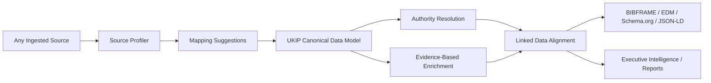

## Why

UKIP needs a governing specification for its semantic canonical layer. The platform is evolving from a flexible ingestion and enrichment system into an agnostic data-model engine that can ingest arbitrary source structures, profile them, map them into a canonical model, resolve authority records, enrich with evidence, and align outputs with linked-data standards.

Without a governing layer, domain-specific specs can evolve independently and create fragmentation:

- Affiliation normalization may define institution semantics without a shared authority contract.
- Geographic entities may define place semantics without shared canonical identity rules.
- Provenance layering may define UI trust semantics without enforcing source/enrichment/authority separation across the model.
- Future bibliographic, cultural heritage, dataset, grant, patent, or organization specs may duplicate mapping and linked-data assumptions.

This spec establishes the column vertebral of UKIP's data layer: every source-specific, domain-specific, or enrichment-specific data model spec must subordinate itself to a shared canonical semantic governance contract.

## What Changes

- **New**: Canonical semantic data governance contract for all UKIP data-model specs.
- **New**: Data-model spec dependency rules that require subordinate specs to declare how they map into canonical identity, provenance, authority resolution, enrichment, and linked-data alignment.
- **New**: Source profiling and mapping suggestion requirements for arbitrary ingested sources.
- **New**: Evidence-based enrichment governance to prevent weakly structured or untrusted enrichment from overriding canonical identity.
- **New**: Linked-data alignment governance for BIBFRAME, Europeana EDM, schema.org, JSON-LD, and future RDF-compatible exports.
- **Modified**: Existing active specs for affiliations, institutions, provenance, geography, and stakeholder intelligence should be treated as subordinate specializations of this governance layer.

## Capabilities

### New Capabilities

- `canonical-semantic-governance`: Rules that govern all canonical data-model specs and their dependencies.
- `source-profiling-contract`: Requirements for profiling arbitrary ingested source structures before mapping.
- `mapping-suggestion-contract`: Requirements for proposed mappings into the UKIP canonical data model.
- `canonical-model-authority-boundary`: Rules separating canonical identity from source data, enrichment data, and authority resolution.
- `linked-data-output-governance`: Standards alignment requirements for JSON-LD/RDF-compatible exports.

### Governed / Subordinate Capabilities

- `entity-provenance-layering`
- `scientific-affiliation-contract`
- `openalex-affiliation-mapping`
- `institution-reconciliation-service`
- `institution-authority-records`
- `geographic-entity-model`
- `geographic-reconciliation-service`
- `geographic-relationship-contract`
- `linked-data-geographic-alignment`
- Future bibliographic, dataset, grant, patent, organization, person, cultural heritage, and project data-model specs.

## Canonical Flow

## Impact

- **Architecture**: Establishes the governing contract for source ingestion, mapping, canonical modeling, authority resolution, enrichment, linked-data export, and executive intelligence.
- **Specs**: Requires data-model-related specs to declare their relationship to this governance layer.
- **Backend**: Future services should expose source profiling, mapping suggestions, canonical field states, authority links, and enrichment provenance as distinct concerns.
- **Frontend**: Future mapping, entity detail, evidence, and stakeholder intelligence UI should reflect governance layers rather than provider-specific fields.
- **Quality**: Prevents enrichment data from being treated as canonical unless it is resolved, provenanced, and confidence-scored.
- **Linked Data**: Keeps BIBFRAME, EDM, schema.org, JSON-LD, and future GeoSPARQL/RDF exports aligned with the same canonical contract.

## Success Criteria

- Every new data-model spec declares whether it is a governing spec, subordinate canonical specialization, source adapter spec, authority resolver spec, enrichment spec, or presentation spec.
- Arbitrary ingested sources can be profiled before mapping into UKIP canonical semantics.
- Mapping suggestions preserve source provenance and never silently overwrite canonical identity.
- Authority resolution and enrichment are separated from original ingestion and canonical identity.
- Linked-data outputs can be generated from governed canonical semantics rather than provider-specific payloads.
- Executive reports consume canonical, authority-resolved, and evidence-enriched views with transparent provenance.
