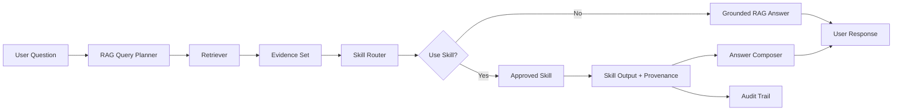

## Why

UKIP's RAG module currently answers questions over indexed evidence. The next strategic step is to make RAG capable of invoking governed skills: specialized, auditable capabilities that can reconcile affiliations, grade evidence, align metadata to linked-data models, generate stakeholder briefings, or perform domain-specific reasoning over retrieved evidence.

This matters for agentic AI because UKIP should not treat an agent as an unrestricted autonomous actor. Instead, agentic behavior should emerge from controlled orchestration: retrieve evidence, choose an approved skill, execute it within policy, return grounded output, and preserve an audit trail.

Without a governed skill layer, future AI features may duplicate logic, bypass canonical semantic governance, or generate plausible but weakly grounded outputs. A RAG skill orchestration feature creates a disciplined bridge between retrieval, semantic data governance, and AI-assisted workflows.

## What Changes

- **New**: A RAG skill orchestration capability that allows RAG sessions to invoke approved skills over retrieved evidence.
- **New**: Skill registry contract describing skill metadata, input/output schema, allowed evidence types, governance level, and execution constraints.
- **New**: Skill routing contract that determines when a user query should be answered directly by RAG, delegated to a skill, or rejected/escalated.
- **New**: Evidence-grounded execution rules that require citations, confidence, provenance, and review status for skill outputs.
- **New**: UI and audit requirements for exposing when a skill was used, what evidence it consumed, and what output it produced.

## Strategic Positioning

This feature is a high-value building block for:

- Agentic AI workflows that remain evidence-governed.
- Research stakeholder decision support.
- Canonical semantic data governance enforcement.
- Institution/ROR/OpenAlex reconciliation.
- Geographic and linked-data enrichment.
- Executive intelligence reporting.

## Governed Skill Examples

- `affiliation-reconciliation`: reconcile institutional affiliations against ROR/OpenAlex evidence.
- `bibliographic-normalization`: align bibliographic metadata with BIBFRAME, Europeana EDM, Schema.org, and JSON-LD.
- `geo-entity-resolution`: detect geographic entities, coordinates, jurisdictions, and place relationships.
- `evidence-grading`: grade evidence quality, traceability, and confidence.
- `stakeholder-briefing`: convert retrieved evidence into audience-specific decision narrative.
- `citation-grounding`: ensure every generated claim maps to explicit evidence references.
- `research-gap-analysis`: identify thematic, institutional, geographic, or methodological gaps.

## Architecture

## Dependencies

- `ukip-enterprise-architecture-governance`: Governs AI as a transversal enterprise capability.
- `canonical-semantic-data-governance`: Governs source, canonical, authority, enrichment, and linked-data boundaries.
- `entity-provenance-layering`: Provides trust semantics for source vs enrichment vs authority outputs.
- `research-stakeholder-executive-demo`: Consumes skill-augmented outputs for stakeholder-facing intelligence.
- `geographic-entity-semantic-layer`: Provides future geographic skill targets.
- `institution-affiliation-reconciliation`: Provides future institutional reconciliation skill targets.

## Impact

- **Backend**: Introduces skill registry, skill router, skill invocation service, schema validation, audit logging, and RAG integration points.
- **Frontend**: Shows skill use, evidence consumed, confidence, provenance, and review status inside RAG responses.
- **Data governance**: Prevents skills from silently modifying canonical identity or enrichment fields without governed promotion.
- **Security**: Restricts skill execution by allowlist, tenant/org scope, evidence scope, and policy.
- **Product**: Turns RAG into an intelligent workbench rather than a generic chat surface.

## Success Criteria

- RAG can answer normally when no skill is needed.
- RAG can route eligible questions to an approved skill using retrieved evidence.
- Every skill invocation records input evidence IDs, output, confidence, provenance, policy result, and review status.
- Skill outputs are visibly distinguished from direct RAG narrative.
- Low-confidence or unsupported skill outputs are marked as candidates, not canonical facts.
- Future agentic workflows can chain governed skills without bypassing evidence or canonical governance.
