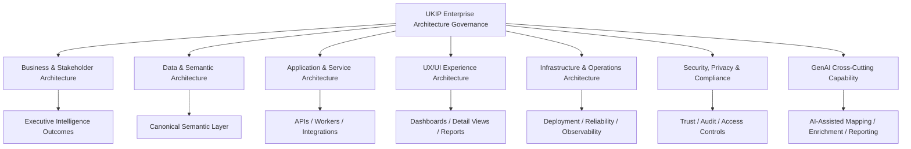

## Why

UKIP needs an enterprise architecture governance layer that organizes every strategic product and implementation decision across business, stakeholders, data, services, UX/UI, infrastructure, operations, and AI capabilities.

The platform is no longer just a set of features. UKIP is becoming a scientific intelligence architecture with:

- executive stakeholder value propositions,
- semantic canonical data governance,
- authority and evidence-based enrichment,
- AI-assisted intelligence workflows,
- research-facing UX/UI experiences,
- backend services and integration boundaries,
- deployment, reliability, security, and observability concerns.

Without an enterprise architecture spec, decisions can become locally correct but globally inconsistent. A data model change may not connect to stakeholder value. A UX feature may not expose provenance. A service may bypass canonical governance. A deployment decision may weaken reliability or auditability. This spec creates the high-level orchestration layer for present and future UKIP decisions.

## What Changes

- **New**: Enterprise architecture governance layer for UKIP.
- **New**: Architecture decision contract aligned to business value, stakeholder scope, UX/UI, services, data, infrastructure, operations, security, and GenAI impact.
- **New**: Capability map that subordinates product, data, service, and infrastructure specs to a unified architecture model.
- **New**: AI-augmented architecture principle: GenAI is treated as a cross-cutting capability governed by evidence, provenance, human review, and measurable impact.
- **Modified**: Existing specs such as `canonical-semantic-data-governance`, `research-stakeholder-executive-demo`, and future implementation specs should reference the enterprise architecture layer when they affect strategic scope.

## Capabilities

### New Capabilities

- `enterprise-architecture-governance`: Governs UKIP architecture decisions across business, data, services, UX/UI, infrastructure, operations, and AI.
- `architecture-decision-record-contract`: Defines how strategic decisions are documented, traced, and reviewed.
- `business-stakeholder-scope`: Defines stakeholder segments, value propositions, business capabilities, and success metrics.
- `application-service-architecture`: Defines service boundaries, integration contracts, API responsibilities, and orchestration patterns.
- `infrastructure-operations-architecture`: Defines deployment, reliability, observability, security, privacy, and operational readiness concerns.
- `ux-ui-architecture-governance`: Defines UX/UI decisions as part of enterprise architecture rather than isolated screens.
- `genai-cross-cutting-capability`: Defines GenAI as a governed transversal capability across ingestion, mapping, enrichment, analytics, reporting, and architecture operations.

### Governed / Subordinate Capabilities

- `canonical-semantic-data-governance`
- `source-profiling-contract`
- `mapping-suggestion-contract`
- `entity-provenance-layering`
- `scientific-affiliation-contract`
- `institution-reconciliation-service`
- `geographic-entity-semantic-layer`
- `research-stakeholder-executive-demo`
- Future specs for APIs, services, dashboards, agents, reporting, deployment, observability, security, and stakeholder workflows.

## Architecture Scope

## Impact

- **Product strategy**: Links every major feature to stakeholder value, business capability, and measurable outcome.
- **Architecture**: Establishes an orchestration layer above data, service, UX/UI, infrastructure, and AI specs.
- **Specs**: Future specs must declare architectural impact and dependencies.
- **Implementation**: Teams can reason about whether a change affects business capabilities, data governance, APIs, UX, operations, or AI risk.
- **Governance**: Strategic decisions become traceable through architecture decision records.
- **AI**: GenAI is embedded as a governed capability, not an uncontrolled feature layer.

## Success Criteria

- Every strategic UKIP spec can be mapped to one or more enterprise architecture domains.
- Architecture decisions explain business value, affected stakeholders, data impact, service impact, UX impact, infrastructure impact, and GenAI impact where applicable.
- The semantic canonical layer is clearly positioned as UKIP's data architecture backbone.
- UX/UI decisions are connected to stakeholder workflows and evidence/provenance requirements.
- Infrastructure decisions are tied to reliability, observability, deployment safety, and security.
- GenAI-assisted capabilities are governed by evidence, confidence, provenance, review, and measurable stakeholder impact.
