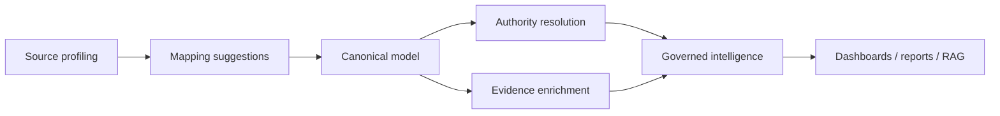

## Context

UKIP is evolving into a scientific intelligence platform. That evolution requires enterprise architecture discipline without becoming bureaucratic. TOGAF-inspired thinking is useful, but UKIP needs a practical architecture method tailored to its own product thesis:

- scientific and institutional intelligence,
- evidence-based enrichment,
- semantic canonical modeling,
- authority resolution,
- linked-data interoperability,
- executive reporting,
- stakeholder-specific decision support,
- GenAI as a transversal accelerator.

This spec acts as UKIP's enterprise architecture organizer. It does not replace detailed specs. It governs how they fit together.

## Enterprise Architecture Baseline

### Architecture domains and owners

| Domain | Scope | Accountable owner |
| --- | --- | --- |
| Business and stakeholder architecture | Stakeholders, value propositions, capability map, success metrics, pilot outcomes | Product / strategy owner |
| Data and semantic architecture | Canonical semantics, source profiling, mapping, provenance, authority, enrichment, linked-data alignment | Data architecture owner |
| Application and service architecture | APIs, services, adapters, workers, schedulers, analytics, reporting, integration boundaries | Backend/platform owner |
| UX/UI experience architecture | Navigation, dashboards, entity detail, evidence, review workflows, reports, accessibility | Product design owner |
| Infrastructure and operations architecture | Deployment, migrations, jobs, observability, backup, reliability, recovery | Operations/platform owner |
| Security, privacy, and compliance architecture | Auth, authorization, audit, PII, source licensing, provider terms, retention, secrets | Security/compliance owner |
| GenAI cross-cutting capability | AI-assisted mapping, reconciliation, reporting, RAG, governance automation, review thresholds | AI governance owner |

Owners are accountability roles, not necessarily separate people. A single maintainer may hold multiple owner roles in an early-stage delivery context, but specs still declare which role is accountable.

### Active spec classification

| Spec | Primary architecture domain | Secondary domains |
| --- | --- | --- |
| `canonical-semantic-data-governance` | Data and semantic architecture | Business/stakeholder, UX/UI, GenAI |
| `domain-agnostic-core-cleanup` | Data and semantic architecture | UX/UI, application/service |
| `scientific-affiliation-normalization` | Data and semantic architecture | Application/service, business/stakeholder |
| `institution-affiliation-reconciliation` | Data and semantic architecture | Application/service, UX/UI, security/privacy |
| `entity-provenance-layering` | UX/UI experience architecture | Data/semantic, business/stakeholder |
| `geographic-entity-semantic-layer` | Data and semantic architecture | Application/service, linked-data interoperability, UX/UI |
| `ukip-design-system-foundation` | UX/UI experience architecture | Business/stakeholder, accessibility, data/semantic |
| `research-stakeholder-executive-demo` | Business and stakeholder architecture | UX/UI, data/semantic, reporting |
| `authority-enrichment-bridge` | Application and service architecture | Data/semantic, UX/UI, GenAI |
| `rag-skill-orchestration` | GenAI cross-cutting capability | Data/semantic, application/service, UX/UI, security/privacy |

### Relationship to canonical semantic data governance

`ukip-enterprise-architecture-governance` is the top-level organizer. It decides how business value, UX, service boundaries, operations, security, and AI fit together.

`canonical-semantic-data-governance` is the data architecture backbone beneath it. It governs how UKIP represents source evidence, canonical identity, authority resolution, enrichment observations, linked-data alignment, and evidence-backed intelligence.

The relationship is:

- Enterprise architecture decides whether a change is strategic and which architecture domains it affects.
- Canonical semantic governance decides whether a data-model change preserves source/canonical/enrichment/authority boundaries.
- Strategic specs that affect data semantics reference both layers.

### Strategic architecture decision criteria

A change qualifies as a strategic architecture decision when it does one or more of the following:

- Changes canonical identity, provenance, authority, enrichment, or linked-data semantics.
- Introduces or removes a core service boundary, API contract, scheduler, worker, adapter class, or orchestration pattern.
- Changes stakeholder-facing decision workflows, executive reporting, or pilot value propositions.
- Changes UX architecture for trust, provenance, confidence, AI disclosure, or review workflows.
- Changes production deployment, migration lifecycle, observability, backup/recovery, or reliability posture.
- Changes authentication, authorization, tenant isolation, auditability, privacy, licensing, or provider-terms posture.
- Introduces GenAI behavior that affects mapping, reconciliation, reporting, recommendations, or user-facing claims.

Routine bug fixes, copy edits, and narrow tests do not need architecture decision records unless they alter one of those strategic concerns.

### Architecture decision record template

```markdown
# ADR: <decision title>

- Date:
- Status: proposed | accepted | superseded | rejected
- Related specs:
- Affected architecture domains:
- Business/stakeholder driver:
- Context:
- Options considered:
- Decision:
- Rationale:
- Data/provenance impact:
- Service/API impact:
- UX/UI impact:
- Infrastructure/operations impact:
- Security/privacy impact:
- GenAI impact:
- Risks and mitigations:
- Validation evidence:
- Follow-up tasks:
```

## Goals / Non-Goals

**Goals:**
- Define UKIP's enterprise architecture domains.
- Require strategic specs and major implementation decisions to declare their architectural impact.
- Connect business/stakeholder goals with data, services, UX/UI, infrastructure, operations, security, and AI.
- Establish an architecture decision record contract.
- Treat GenAI as a governed cross-cutting capability.
- Position `canonical-semantic-data-governance` as the data architecture backbone under the enterprise architecture layer.

**Non-Goals:**
- Fully implement TOGAF ADM artifacts.
- Create heavyweight approval gates for every small code change.
- Replace OpenSpec as the change-management mechanism.
- Replace product discovery, UX research, security review, or operational runbooks.
- Treat GenAI as a substitute for data quality, evidence, or authority resolution.

## Enterprise Architecture Domains

### 1. Business and stakeholder architecture

Defines why UKIP exists and who it serves.

Includes:

- stakeholder segments,
- research decision contexts,
- executive intelligence outcomes,
- institutional value propositions,
- adoption and success metrics,
- capability maturity,
- product-market assumptions.

Representative stakeholders:

- research executives,
- research office leaders,
- institutional strategy teams,
- data stewards,
- librarians and knowledge managers,
- grant and portfolio managers,
- scientific intelligence analysts,
- policy and impact teams.

#### Stakeholder segments and decision contexts

| Segment | Decision context | UKIP evidence need | Primary outcome |
| --- | --- | --- | --- |
| Research executives | Portfolio direction, institutional positioning, strategic investments | Canonical publications, affiliations, citations, concepts, institutions, geography | Faster evidence-backed strategic readouts |
| Research office leaders | Funding, collaboration, reporting, compliance | Author/institution resolution, grants, outputs, provenance | Cleaner reporting and reduced manual reconciliation |
| Librarians and knowledge managers | Metadata quality, authority control, discovery | Source evidence, canonical records, authority links, linked-data alignment | Trustworthy knowledge curation |
| Scientific intelligence analysts | Trend, topic, partnership, and impact analysis | Enriched observations, provenance, confidence, semantic relationships | Repeatable analytical workflows |
| Institutional strategy teams | Benchmarking, strengths, opportunity areas | Executive dashboards, canonical KPIs, narrative evidence | Decision-ready briefings |
| Data stewards | Import quality, mapping review, data governance | Source profiles, mapping suggestions, validation states | Governed ingestion and fewer silent errors |

#### Capability-to-outcome map

| UKIP capability | Stakeholder outcome | Primary architecture domain |
| --- | --- | --- |
| Source profiling and mapping suggestions | Faster onboarding of unfamiliar datasets with reviewable evidence | Data/semantic |
| Canonical semantic model | Stable cross-domain records and relationships | Data/semantic |
| Authority resolution | Trusted identity for authors, institutions, places, publications, and datasets | Data/semantic + application/service |
| Evidence-based enrichment | Stronger analytics without erasing source truth | Data/semantic |
| Review queues | Human-governed trust decisions | UX/UI + security/privacy |
| Executive dashboards and reports | Stakeholder-readable decisions with provenance | Business/stakeholder + UX/UI |
| RAG and skill orchestration | Evidence-grounded assistance over governed data | GenAI + application/service |

Executive intelligence value propositions:

- Reduce manual reconciliation before portfolio or research-impact conversations.
- Explain strategic claims with source, authority, enrichment, and review evidence.
- Turn heterogeneous scientific data into reusable institutional intelligence.
- Make quality gaps visible before dashboards and reports are used externally.
- Support pilot demos with real canonical and authority-resolved data under the narrative.

Research stakeholder success metrics:

- Time from source import to first reviewed dashboard.
- Percentage of key records with canonical identity and provenance.
- Authority resolution coverage for authors, institutions, places, and publications.
- Review queue throughput and rejection/confirmation rates.
- Share of executive report claims with traceable evidence.
- Reduction in duplicate or ambiguous institutional/author records.

`research-stakeholder-executive-demo` maps to business/stakeholder architecture by packaging these capabilities into a decision readout. It depends on data/semantic architecture for canonical evidence, UX/UI architecture for trust presentation, and application/service architecture for stable report and dashboard APIs.

### 2. Data and semantic architecture

Defines UKIP's knowledge backbone.

Includes:

- semantic canonical layer,
- source profiling,
- mapping suggestions,
- entity and relationship modeling,
- provenance and field states,
- authority resolution,
- evidence-based enrichment,
- linked-data alignment,
- data quality and review workflows.

`canonical-semantic-data-governance` is the principal subordinate spec for this domain.

#### Data architecture backbone

`canonical-semantic-data-governance` is the backbone for this domain. Enterprise architecture treats it as the authoritative source for:

- source profiling contracts,
- mapping suggestion review states,
- canonical entity and relationship envelopes,
- authority link semantics,
- enrichment observation boundaries,
- linked-data alignment strategy,
- provenance and confidence rules.

The enterprise architecture view is:



Data quality and provenance principles:

- Strategic decisions prefer canonical records over raw payload fields.
- Raw source evidence remains accessible after mapping and enrichment.
- Authority links and enrichment observations are separate evidence classes.
- Confidence must be explainable through score breakdowns, source evidence, or review state.
- Human review decisions are auditable and should be visible to downstream claims where material.
- Linked-data exports are generated from canonical semantics, not raw provider records.

Architecture impact declaration for data-model specs:

- Identify affected canonical entities, relationships, observations, authority links, or field states.
- Declare source payloads and providers consumed.
- State whether the change is a source adapter, authority resolver, enrichment provider, presentation layer, or canonical specialization.
- Describe downstream impacts on APIs, analytics, graph, reports, RAG, and UX review surfaces.
- Document migration and backward-compatibility expectations.

Active data specs validate against this architecture by preserving the boundaries among original source, mapped canonical candidate, authority decision, enrichment observation, and presentation summary.

### 3. Application and service architecture

Defines how the product is decomposed into capabilities and services.

Includes:

- backend APIs,
- ingestion services,
- enrichment adapters,
- reconciliation services,
- analytics services,
- reporting services,
- scheduler/worker patterns,
- integration contracts,
- inter-service dependencies,
- failure boundaries.

#### Service inventory

| Service area | Representative components | Architecture responsibility |
| --- | --- | --- |
| Ingestion and import | upload/API import routers, scientific import, connector adapters, import batches | Accept source data, preserve original payload evidence, trigger profiling/mapping/enrichment work. |
| Entity and relationship services | entity routers, relationship manager, graph/relationship helpers | Expose canonical records, relationships, validation states, and downstream graph surfaces. |
| Enrichment services | enrichment worker, enrichment adapters, scheduled imports, quality/source health | Add provider observations without overwriting canonical identity. |
| Authority and reconciliation | authority router, author resolution, institution reconciliation, authority links | Resolve identity against registries and keep review decisions auditable. |
| Analytics services | topic, coauthorship, author, geographic, trend, correlation analyzers | Consume canonical/enriched data and expose reusable analytical summaries. |
| Reporting and exports | report routers, executive dashboards, sales/stakeholder exports | Produce stakeholder readouts with provenance and confidence context. |
| AI assistance and RAG | RAG endpoints, agentic chat, skill orchestration, query reformulation | Generate suggestions and narratives only from governed evidence and reviewable outputs. |
| Operations and orchestration | schedulers, background workers, health checks, reset/workspace operations | Keep long-running work observable, restartable, and operationally safe. |

#### Service boundary principles

- Ingestion services preserve source evidence and should not perform irreversible canonical promotion without a mapping decision.
- Enrichment services create observations; they do not own canonical identity.
- Reconciliation services own authority scoring, review state, accepted/rejected decisions, and authority links.
- Analytics services are consumers of governed data and should not mutate canonical or authority records.
- Reporting services may summarize evidence but must preserve claim traceability.
- AI assistance may suggest mappings, explanations, or narratives; it must not silently write canonical identity or strategic claims.
- Operations services may clean, reset, or migrate state only through explicit administrative contracts.

#### API contract expectations

Stakeholder-facing APIs should:

- return stable identifiers for entities, authority records, relationships, observations, and review decisions,
- include provenance or evidence references when returning strategic claims,
- expose confidence and review state where trust affects interpretation,
- distinguish raw source fields, canonical fields, enrichment observations, and authority decisions,
- be idempotent for apply/reconcile operations where retry is plausible,
- provide clear partial-failure responses for external provider calls,
- avoid leaking provider payload shape as the durable product contract.

#### Integration dependency and failure rules

- External provider failures should degrade enrichment/reconciliation results without corrupting canonical records.
- Provider-backed operations should record failure reason and retry eligibility when appropriate.
- Long-running imports, enrichment, and reconciliation should be batchable and restartable.
- Cross-service writes should happen through owned service boundaries or shared canonical contracts, not ad hoc field mutation.
- UI surfaces should handle empty, pending, partial, and failed states as normal product states.
- Specs that add provider dependencies must document timeout, retry, rate-limit, and fallback behavior.

#### Service architecture review checklist

Future implementation specs should answer:

- Which service area owns the change?
- Which APIs, workers, adapters, or schedulers are affected?
- Does the change read, write, or merely present canonical data?
- Does it preserve source/canonical/enrichment/authority boundaries?
- Is the operation idempotent or retry-safe?
- What happens when an external provider, worker, or downstream analyzer fails?
- What audit, provenance, or confidence evidence is emitted?
- Which tests prove service boundaries and failure behavior?

### 4. UX/UI experience architecture

Defines how users perceive and operate UKIP.

Includes:

- navigation architecture,
- dashboards,
- entity detail views,
- mapping and review workflows,
- evidence traceability UI,
- executive reporting experiences,
- visual language,
- accessibility,
- progressive disclosure for technical evidence.

UX/UI must express architecture truth: source, canonical, enrichment, authority, confidence, and AI-generated content should be visually distinguishable where relevant.

#### Product surface architecture

| Surface | Primary purpose | Trust architecture requirements |
| --- | --- | --- |
| Dashboards | Monitor portfolio, domain, quality, trends, and stakeholder-ready KPIs | Prefer canonical and enriched metrics; expose gaps, confidence, and stale/partial states. |
| Entity detail | Inspect one record across raw source, normalized identity, enrichment, authority, relationships, and audit | Separate source, canonical, enrichment, authority, and audit layers; preserve raw evidence. |
| Ingestion and mapping | Bring new files/API/connector data into UKIP | Show source profile, mapping suggestions, confidence, conflicts, and review state before promotion. |
| Review queues | Resolve ambiguous mappings, authority candidates, institutions, authors, and quality issues | Provide evidence, score breakdown, accept/reject actions, and audit-ready decisions. |
| Reports and exports | Package stakeholder-facing readouts | Explain claims with provenance, confidence, data freshness, and unresolved caveats. |
| RAG/AI assistance | Ask questions, draft narratives, and receive suggestions | Disclose AI-generated content and link answers to governed evidence. |
| Settings/operations | Manage integrations, schedules, webhooks, workspace reset, auth, and governance | Use explicit confirmation for destructive or external-facing changes. |

Navigation principles:

- Put ingestion, review, analytics, and reports in a visible workflow order.
- Avoid hiding trust work behind dashboards; review queues are a first-class surface.
- Keep entity detail as the inspection hub for record-level provenance.
- Keep reports and dashboards separate: dashboards support exploration, reports support communication.
- AI assistance should be adjacent to evidence, not a replacement for review workflows.

#### UX principles for trust-bearing data

- Provenance: show where a claim or field came from when it affects trust or action.
- Authority: display registry source, identifier, match status, evidence, confidence, and review state.
- Enrichment: distinguish provider observations from canonical identity and authority decisions.
- Confidence: use numeric confidence plus qualitative state where possible; never rely on color alone.
- Null states: distinguish absent data, not-yet-run enrichment, provider failure, low-confidence mapping, and intentionally rejected evidence.
- AI-generated content: label generated suggestions/narratives and provide links to evidence, prompt context, or review action where material.
- Progressive disclosure: summarize for executives, but keep evidence drill-down available for stewards and analysts.
- Accessibility: trust signals must be readable through text, structure, and state labels, not only icons or color.

#### Stakeholder workflow mapping

| Workflow | Primary users | UX surfaces |
| --- | --- | --- |
| Import and profile a dataset | Data stewards, analysts | Ingestion/mapping, source profile preview, mapping review |
| Resolve authors and institutions | Research office, librarians, data stewards | Authority review queues, entity detail, audit trail |
| Inspect a strategic entity | Analysts, executives, stewards | Entity detail, relationships, authority/enrichment panels |
| Understand portfolio health | Research executives, strategy teams | Dashboard, quality panels, review backlog summaries |
| Produce an executive readout | Executives, strategy teams, analysts | Reports, dashboard extracts, evidence explanations |
| Ask evidence-grounded questions | Analysts, leadership support | RAG/AI assistant with citations and governed context |

#### Executive dashboard and report requirements

- Lead with decision-relevant KPIs, not raw operational tables.
- Include data quality and authority coverage where conclusions depend on them.
- Make confidence, coverage, and unresolved issues visible near claims.
- Link strategic claims back to canonical records, authority links, enrichment observations, or source evidence.
- Use stable report sections that distinguish source evidence, authority resolution, enrichment observations, and narrative interpretation.
- Avoid presenting AI-generated summaries as final conclusions without evidence grounding and review state.

#### UX/UI architecture review checklist

Future frontend specs should answer:

- Which product surface owns the workflow?
- Which stakeholder segment and decision context is being served?
- Which trust-bearing states are shown: provenance, authority, enrichment, confidence, null, review, AI-generated?
- Can the user inspect evidence behind a claim or recommendation?
- Are pending, partial, failed, empty, rejected, and confirmed states visually and textually distinct?
- Does the UI preserve source/canonical/enrichment/authority boundaries?
- Are destructive or irreversible actions confirmed and auditable?
- Does the design work for repeated operational use, not only a demo path?
- What component, smoke, or accessibility test proves the workflow renders correctly?

### 5. Infrastructure and operations architecture

Defines how UKIP runs reliably.

Includes:

- deployment topology,
- environments,
- containerization,
- database migrations,
- background workers,
- health checks,
- observability,
- logging,
- backup/restore,
- operational runbooks,
- scalability,
- cost posture.

### 6. Security, privacy, and compliance architecture

Defines trust and protection concerns.

Includes:

- authentication and authorization,
- data access boundaries,
- audit trails,
- personally identifiable information,
- source licensing constraints,
- provider API terms,
- retention policies,
- secure configuration,
- secrets management.

### 7. GenAI cross-cutting capability

Defines how GenAI participates across the platform.

GenAI may assist:

- source profiling,
- mapping suggestion generation,
- entity reconciliation review,
- anomaly and inconsistency detection,
- report narrative generation,
- evidence explanation,
- stakeholder-specific brief generation,
- architecture decision drafting.

GenAI must be governed by:

- provenance,
- evidence grounding,
- confidence,
- review thresholds,
- non-overwrite rules,
- auditability,
- stakeholder impact measurement.

## Decisions

### D1: Enterprise architecture sits above semantic data governance

**Decision:** `ukip-enterprise-architecture-governance` SHALL govern strategic UKIP specs across business, data, services, UX/UI, infrastructure, operations, security, and AI. `canonical-semantic-data-governance` SHALL be treated as its data architecture backbone.

**Rationale:** UKIP's semantic model is central, but enterprise architecture must also govern business value, user experience, service boundaries, deployment, security, and operational readiness.

### D2: Strategic specs declare architecture impact

**Decision:** Any strategic spec SHALL identify affected architecture domains and describe impact, dependencies, risks, and success criteria.

**Rationale:** This keeps implementation aligned with stakeholder outcomes and prevents isolated technical decisions.

### D3: Architecture decisions are lightweight but traceable

**Decision:** UKIP SHALL use lightweight architecture decision records for decisions that change strategic direction, core data semantics, service boundaries, infrastructure posture, security posture, UX architecture, or GenAI behavior.

**Rationale:** UKIP needs architectural memory without slowing routine development.

### D4: GenAI is transversal and governed

**Decision:** GenAI SHALL be modeled as a cross-cutting capability across architecture domains, not as an isolated product feature.

**Rationale:** GenAI can influence ingestion, mapping, enrichment, UX, reporting, and governance. Treating it as transversal makes its risks and value visible.

### D5: UX/UI reflects data and trust architecture

**Decision:** UX/UI architecture SHALL expose provenance, confidence, authority, enrichment, and AI-generated status when those distinctions affect user trust or decision-making.

**Rationale:** Research stakeholders need to understand why UKIP is recommending or reporting something.

### D6: Infrastructure choices must support product trust

**Decision:** Infrastructure and operations decisions SHALL be evaluated against reliability, observability, deployment safety, data integrity, and recovery.

**Rationale:** Scientific intelligence loses credibility if the system is unstable, opaque, or difficult to recover.

## Architecture Decision Record Shape

Strategic decisions should capture:

- decision title,
- date,
- status,
- context,
- business/stakeholder driver,
- affected architecture domains,
- options considered,
- decision,
- rationale,
- data/provenance impact,
- service/API impact,
- UX/UI impact,
- infrastructure/operations impact,
- security/privacy impact,
- GenAI impact,
- risks and mitigations,
- validation evidence,
- related specs.

## Spec Subordination Rules

New specs should state whether they affect:

- business/stakeholder architecture,
- data/semantic architecture,
- application/service architecture,
- UX/UI experience architecture,
- infrastructure/operations architecture,
- security/privacy/compliance architecture,
- GenAI cross-cutting capability.

Specs that affect more than one domain should identify the primary domain and secondary impacts.

## Open Questions

- Should architecture decision records live under `openspec/architecture-decisions/` or inside each change?
- What level of change requires an architecture decision record?
- Should UKIP maintain a formal capability map artifact outside OpenSpec?
- How should GenAI impact be scored: risk, value, automation level, or evidence dependency?
- Which stakeholder metrics best represent platform maturity?

## Rollout Plan

1. Establish the enterprise architecture governance spec.
2. Classify active specs by architecture domain.
3. Add lightweight architecture decision record templates.
4. Define UKIP capability map v1.
5. Connect semantic data governance to enterprise architecture.
6. Connect stakeholder demo/reporting specs to business and UX architecture.
7. Connect production readiness specs to infrastructure and operations architecture.
8. Define GenAI governance principles and review thresholds.
